# CAB203 | 2022 S1
Dr Matthew McKague | Notes for CAB203 at the Queensland University of Technology

<br>

# Table of Contents
<ul>
	<li><a href="#CAB203">CAB203: Discrete Structures</a></li>
	<ul>
		<li><a href="#week1">Week 1</a>: Foundations</li>
		<li><a href="#week2">Week 2</a>: Data Representations</li>
		<li><a href="#week3">Week 3</a>: Propositional Logic</li>
		<li><a href="#week4">Week 4</a>: Set Theory</li>
		<li><a href="#week5">Week 5</a>: Predicate Logic</li>
		<li><a href="#week6">Week 6</a>: Relations and Functions</li>
		<li><a href="#week7">Week 7</a>: Graphs</li>
		<li><a href="#week8">Week 8</a>: Trees</li>
		<li><a href="#week9">Week 9</a>: Directed Graphs</li>
		<li><a href="#week10">Week 10</a>: Finite State Automata</li>
		<li><a href="#week11">Week 11</a>: Linear Algebra</li>
		<li><a href="#week12">Week 12</a>: </li>
		<li><a href="#week13">Week 13</a>: </li>
	</ul>
</ul>

---

<br>

<h1 id="CAB203">CAB203: Discrete Structures</h1>
In trying to solve complex problems, a powerful approach is to transform the problem into a simpler model by abstracting away some of the less important details. Once in this more abstract form, powerful mathematical techniques (developed over centuries) can be brought to bear. For computing related problems, the most relevant mathematical concepts and techniques come from the field of discrete mathematics, and include arithmetic, logic, set theory, graph theory and functions. This unit demonstrates how these mathematical concepts and techniques can be used to model and solve real-world problems. The unit also supports subsequent units: CAB301 where algorithms involving graphs are introduced and CAB402 where the mathematical notion of a function provides the basis for alternative programming paradigms.

<br>

<h2 id="week1">Week 1: Foundations</h2>

### Extraneous Properties
Suppose we have the following problem:
- You have two baskets of apples
- You know how many apples are in each basket
- You want to know how many apples there would be if you put all apples into one basket

How would we go about solving this? 
It's first important to note that there is a lot of useless information given to us when trying to solve this problem. 

For example the
- Size and shape of each basket and apple
- Position and orientation of each apple and each basket
- Change in position and orientation of each apple and basket

We can use a process called abstraction to simplify the problem by throwing away all the information that is not needed.

### Abstractions
Abstractions allow us to capture the relevant properties of any given situation. Let's take a look at how we would abstract the problem given above.

<br>

We first start by extracting all important information needed from the problem and assigning each piece to an arbitrary value.

- $x$ = number of apples in each basket *A* before moving them
- $y$ = number of apples in each basket *B* before moving them
- $z$ = number of apples in the final basket after moving

<br>

Now that we've extracted this information we can go ahead and write an equation that will allow us to solve for $z$.

$$
	z = x + y
$$

<br>

One thing to remember when solving problems using abstraction is that abstraction may not work 100% of the time. In reference to the question above this could be because:
- The abstraction may not be exact. Baskets only hold a maximum number of apples. The final basket may have fewer apples than the sum of the original baskets because some apples may have fallen out.
- Abstractions may not have enough information or the wrong information. In our abstraction we assumed that the final basket was empty, what if it wasn't?
- The abstraction may have too much information making it harder to solve the problem. 

### Abstractions on their own
Often abstractions are studied without reference to any particular problem or real situation. In these cases we call an abstraction a mathematical theory. These usually consist of:
- A collection of mathematical objects: numbers, operations (addition, subtraction)
- Axioms: Statements about how objects are related to each other ($a + b = b + a$)  

Additionally, new relationships can be derived by applying logic to the axioms

### Mathematical Problem Solving Approaches
When solving mathematical problems we tend to follow a 4 step plan

1. Analyse the problem for relevant properties
2. Create (or use an existing) abstraction of the situation
3. Solve the problem in the abstraction
4. Translate the solution back into the real situation

<br>

If we were to walk through the problem above outlining these steps it would look something like this:
- Create an abstraction: Assign a number to each basket counting the apples
- Solve the problem in the abstraction: Add the numbers together according to the rules of arithmetic
- Translate the solution back: The sum will tell us how much is in the final basket

### Axioms
As said before an axiom is a statement about how mathematical objects relate to each other. Let's take a look at some examples of axioms:
1. For all natural numbers $a$ and $b$: $a + b$ is a natural number 
2. For all natural numbers $a$ and $b$: $a + b = b + a$
3. For all natural numbers $a$, $b$, and $c$: $(a + b) + c = a + (b + c)$
4. For all natural numbers $a$: $a + 0 = a$

We can then combine axioms with logic to create new true statements about natural numbers. 

$$
	\tag{this is derived from statement 2 and 4} 0 + a = a
$$

### Mathematical Objects
Mathematical objects simply put are just abstractions.
- We can't say anything about what they are. 2 might be the number of apples in a basket, the number of eyes on my face, etc... Because these are abstract objects, they could correspond to many different concrete objects.
- The only thing we can say about mathematical objects is how they relate to other objects. That is what axioms are for.
- Formally, objects are just symbols. They have no meaning, they are just names.

So what do these relationships look like then?
- Formally, relationships between objects are given by propositions
- Propositions are statements that can be either true or false
- Axioms for mathematical theory for example are propositions that we assert to be true for the objects in the theory

### Applying Theories to Real Situations
A mathematical theory applies to a real situation if you can
- Match up every object in the theory to something in the real situation (or at least hypothetically). For example, for every natural number we can imagine a basket of apples with that amount of apples in it.
- All of the axioms in the theory remain true in the real situation. For example, combining a basket with *a* apples and one with 0 apples gives you a basket with *a* apples.

Using the apple example we can determine properties of the real situation. Combining three baskets with 1, 2, and 3 apples in them will always give a basket with 6 apples. Mathematicians would say that the real situation is a model for the theory.

There are cases however where a theory may not apply. Let's take a look at an example of one that doesn't obey all axioms. Imagine a situation where each number corresponds to the number of members in a committee:
- Alice, Bob and Charlie form the committee for creating new assessment items. This corresponds to the number 3.
- Alice, and Dave form the committee for revising extension request policies. This corresponds to the number 2.
- We add these committees together to create a new committee of Alice, Bob, Charlie and Dave. This corresponds to the number 4. So our equation ends up as $3 + 2 = 4$.

### Truth in Mathematics
Statements in mathematics are always relative to a particular mathematical theory. It is possible for a statement to be true in one theory, but false for another. An example of this being $ab = ba$, this is true for real numbers however, false for matrices. A true statement in a theory says nothing about a real situation if it is not a model for the theory.

Within a theory and its models however, truth is absolute. This means that, by the rules of logic, any true statements in a theory will be true in every model of that theory.

### Computers and Mathematics
Computers are used in an similar way to mathematics:
1. Transform input into bits using a data representation
2. Operate on inputs according to rules embodied in a program
3. Transform bits back into outputs

We can take this one step further by saying:
- Bits are symbols without meaning with data representations linking these symbols to meaningful properties of the problem. This is no different to how mathematical objects work.
- Step 2 gives the relationship between the input and the output. Therefor meaning that the program is an implementation of the rules of some mathematical theory.

### Parity
Parity is just another way of saying whether something is even or odd. 
Integers can have one of two different parities:
- $x$ is *even* means $2 \mid x$ (Divisible by 2)
- $x$ is *odd* means $2 \mid (x-1)$

Some properties of parity include:
- even $\pm$ even = even
- even $\pm$ odd = odd
- odd $\pm$ odd = even

### Clock Arithmetic
Clock arithmetic is a number system where once a number reaches 12 anything that gets added above will be wrapped back to the initial starting point as it is on a 12 hour clock. To see an example of this let's assume it's 10 o'clock, what time will it be if we add 5 hours? 3 o'clock. Using clock arithmetic we can also see that adding any multiple of 12 hours will not change the o'clock value. If it's 10 o'clock and we wait 12 hours, it will still be 10 o'clock (excusing the fact that AM/PM are a thing).

### Modular Arithmetic
Modular arithmetic is an abstraction of parity and clock arithmetic. We know parity uses modulo 2 as there can only be 2 values, even or odd, and we know that clocks use modulo 12 as there are only 12 hours on the clock. Therefor, modular arithmetic says we can have arithmetic modulo $n$ for any positive integer $n$.

Modular arithmetic works by replacing equality with modular equivalence, also called modular congruence. If $a - b \mid n$ then $a$ and $b$ are equivalent *modulo n* and write

$$
	\tag{mod n} a \equiv b 
$$

What this means is 2 things have the same parity if their difference is divisible by n. Another way of looking at this is if 2 things have an equivalent mod n value, then they have the same parity. Let's see an example using

$$
	\tag{mod 2} 5 \equiv 3
$$

Here we see $5 - 3 = 2$ which is divisible by 2 showing us that 5 and 3 have the same parity. We can also see that $5 \mod 2 = 1$ and $3 \mod 2 = 1$ therefor proving that they are modular equivalent.

Modular arithmetic also plays nicely with addition, subtraction and multiplication. Let's look at an example using $a \equiv b + c \equiv d \pmod n$ remembering the axioms we showed before.
- $a + c \equiv b + d \pmod n$
- $a - c \equiv b - d \pmod n$
- $ac \equiv bd \pmod n$

So let's see how these would work with actual values. In the below examples we will be using mod 5.

$$\tag{5 | 7 - 2} 2 \equiv 7$$
$$\tag{5 | 4 - (-1)} 4 \equiv -1$$
$$\tag{5 | 6 - 1} 2 + 4 \equiv 6 \equiv 1$$
$$\tag{5 | 11 - 1} 7 + 4 \equiv 11 \equiv 1$$

These are all valid because all answer evenly divide into 5.

Modular arithmetic can be found being used in many places in the real world such as RSA encryption, CPU integer arithmetic and indices for ring buffers.
### Modular Operations
For computing, we might want to store only small numbers. We can achieve this using the mod operator (commonly tied to the % symbol in many programming languages). The mod operator works such that $a \mod n$ is the smallest non-negative $b$ such that $a \equiv b \pmod n$. In other words, $a \mod n$ is the remainder you get when you divide $a$ by $n$.

### Lemma
A lemma is a proposition that is true in a mathematical theory, derived from its axioms. We can show that it is true by using a proof which shows the steps necessary to get from the axioms to the statement. We can also use other lemmas in the proof if we have already proved them.

### Proof of Lemma
Let's create a lemma and a proof to go along with it to see how all these concepts work together.

Lemma: Let $a$ and $b$ be integers. If $a \mod b = 0$ then $b \mid a$.

Proof:
Let integers $a$ and $b$  be given such that $a \mod b = 0$. Then from the definition of the mod operator we have:  

$$
	a \equiv 0 \pmod b
$$

From the definition of modular equivalence we have:

$$
	b \mid (a-0)
$$

From a well known lemma we see that $a - 0 = a$ for any integer, so $b \mid a$.

This proof is frequently used to determine divisibility or test if a number is even when programming.

### Modular Arithmetic in Python
As mentioned before, if we want to find the mod of something in python we need to use the *%* symbol.

```python
>>> 10 % 7
3
>>> 12 % 7
5
>>> (10 + 12) % 7          # % is evalutated before + so () are needed
1
>>> (10 % 7 + 12 % 7) % 7
1
>>> 10 * 12 % 7            # * and % are evaluated left to right
1
```

### Exponents
An exponent is a value that refers to the number of times a number is multiplied by itself. It is notated as such $a^{n}$ where $a$ is the base and $n$ is the exponent. An example of this follows
$$
	a^{3} = a \cdot a \cdot a
$$

Let's take a look at some of the laws of exponents:
- $(ab)^{n} = a^{n} \cdot b^{n}$
- $a^{m} \cdot a^{n} = a^{m+n}$
- $\tag{when a != 0} a^{m-n} = \frac{a^{m}}{a^{n}}$
- $\tag{when a != 0} a^{-n} = \frac{1}{a^{n}}$
- $a^{0} = 1$
- $(a^{m})^{n} = a^{m \cdot n}$

In computer science we use many prefixes based around the powers of 2. These multipliers will always be used when talking about bits/bytes.

| Prefix | Multiplied by                  |
| ------ | ------------------------------ |
| Kilo   | $2^{10}$                     |
| Mega   | $2^{20}$ or $(2^{10})^{2}$ |
| Giga   | $2^{30}$ or $(2^{10})^{3}$ |
| Tera   | $2^{40}$ or $(2^{10})^{4}$ |
| Peta   | $2^{50}$ or $(2^{10})^{5}$ |
| Exa    | $2^{60}$ or $(2^{10})^{6}$ |

For example:
- $2^{10} = 1024$ is the number of bytes in a kilobyte
- $2^{3} = 8$ is the number of bits in a byte
- $2^{10} \cdot 2^{3} = 2^{10+3} = 8192$ is the number of bits in a kilobyte

### Logarithms
Logarithms are the inverse of exponents. In a simple way it allows us to find the amount of one number we need to multiply to get another. If $n = \log_{a} x$ then $a^{n} = x$. For example the logarithm, or inverse, of $2^{3} = 8$ would be $\log_{2}8 = 3$.

Let's take a look at some of the laws of logarithms:
- $\log_{a}1 = 0$
- $\log_{a}a = 1$
- $\log_{a}(x \cdot y) = \log_{a}x + \log_{a}y$
- $\log_{a}x^{y} = y\log_{a}x$
- $\log_{a}\frac{1}{y} = -\log_{a}y$
- $\log_{a}\frac{x}{y} = \log_{a}x-\log_{a}y$
- $\log_{b}x = (\log_{b}a) \cdot \log_{a}x$

### Base Transformation Law
Most calculators only calculate in base 10 and base e so what happens if we want to calculate in a different base? We can use something called the base transformation law which is written as

$$
	\log_{a}x = \frac{\log_{b}x}{\log_{b}a}
$$

So let's see a working example of this:

$$
	\log_{8}64 = \frac{\log_{2}64}{\log_{2}8} = \frac{6}{3} = 2
$$

And by double checking our answer we can see that it is true

$$
	8^{2} = 64
$$

We can take this one step further and show logarithms in a real world example when using memory and address lines. If
- Each address line is 1 bit
- *n* bits means $2^{n}$ possible states per address ($2^{n}$ states containing $0$ or $1$, or $\{0, 1\}^{n}$ per address)

How many address lines are required for 65536 addresses?

$$
	\log_{2}65536 = 16
$$

How many address lines are required for 4069 kilobytes (one address per byte)?

$$
	\log_{2}(4096 \cdot 2^{10}) = \log_{2}4096 + \log_{2}2^{10} = 12 + 10 = 22
$$

How many address lines are required for 5000 bytes (one address per byte)?

$$
	\log_{2}5000 = 12.28771...
$$

This example becomes a little tricky because we cant have 12.28.. of a byte, we would need to have 13. So how would we expresses this? We can use this notion of ceilings and floors which act as rounding functions that always only go one way. 

| Term    | Definition                                 | Example                                  |
| ------- | ------------------------------------------ | ---------------------------------------- |
| Ceiling | Will always round up to the next integer   | $\lceil a \rceil$ is the next integer above a  |
| Floor   | Will always round down to the next integer | $\lfloor a \rfloor$ is the next integer below a |

So to express the example we had before

$$
	\lceil \log_{2}5000 \rceil = 13
$$

### Exponents and Logs in Python
To use special math functions in python we first need to `import math`. This library gives us access to a majority of the mathematical functions we'll need to use.

```python
>>> import math
>>>
>>> math.log2(8)                    # log2 means log base 2
3.0
>>> 2 ** 3                          # ** is exponentiation
8
>>> math.log2(2 ** 3)
3.0
>>> math.log10(100)                 # log10 means log base 10
2.0
>>> math.log2(100) / math.log2(10)  # base transformation for base 10
2.0
```

<br />

<h2 id="week2">Week 2: Data Representations</h2>

### Bits
Bits are the smallest unit of measurement used to store data on computers. A bit has 2 states generally labeled as *0* or *1*. Due to bits being small we usually string them together to create bit strings which can represent larger values.

Bit-string notation:
- When representing a string we put a bar overtop of the variable: $\overline{x}$
- The set of all strings of length $n$ is $\{0, 1\}^{n}$ (i.e. each bit in a bit string is either $0$ or $1$)
- All bit strings, no matter length, are members of $\{0, 1\}^{*}$ 
- The *j*th bit in $\overline{x}$ is $\overline{x}_{j}$
- When working with bit strings we count from right to left. This means that $\overline{x}_{0}$ is the far most right value.

### Operators
Operators, or operations, are mathematical objects we use to transform other objects. An example of this is the $+$ operator, $+$ is a binary operator that takes in two objects and transforms them into a third object. These operators are commonly used in mathematical theories and used axioms to specify these relationships between objects.

### Bit Operators
Bit operators allow us to manipulate and change bits in certain ways. There are two types of bit operations: operations on a single bit or pairs of bits and operations on a bit string. Below are a few common operands to know.

#### NOT (bit flip)
The NOT operand flips the value stored in a bit (changing 0 to 1 or 1 to 0).

$$
	\begin{array}{c}
		x & \sim x \\
		\hline
		0 & 1 \\
		1 & 0
	\end{array}
$$

#### AND
The AND operand returns 1 if all values are 1, and 0 otherwise. At base value the AND operand works similar to multiplication.

$$
	\begin{array}{c}
		x & y & x\&y \\
		\hline
		0 & 0 & 0 \\
		0 & 1 & 0 \\
		1 & 0 & 0 \\
		1 & 1 & 1
	\end{array}
$$

#### OR
The OR operand returns 1 as long as one of the values is 1, and 0 otherwise.

$$
	\begin{array}{c}
		x & y & x \mid y \\
		\hline
		0 & 0 & 0 \\
		0 & 1 & 1 \\
		1 & 0 & 1 \\
		1 & 1 & 1
	\end{array}
$$

#### XOR
The XOR operand returns 1 as long as only one of the values is 1, and 0 otherwise. Another way of looking at it is addition modulo 2.

$$
	\begin{array}{c}
		x & y & x \verb|^| y \\
		\hline
		0 & 0 & 0 \\
		0 & 1 & 1 \\
		1 & 0 & 1 \\
		1 & 1 & 0
	\end{array}
$$

### Bitwise Operations
We can apply bitwise operations on bit-strings of the same length. So we can say, if $\overline{z} = \overline{x}\&\overline{y}$ then:

$$
	\overline{z}_{j} = \overline{x}_{j} \& \overline{y}_{j}
$$

### Bit Shifting
Using a method called bit-shifting we can shift bits to the left or right of their original position. When we shift bits the positions that become available are replaced with $0$'s.

Left shift:
- $011010 \ll 1 = 110100$
- $100001 \ll 3 = 001000$

Right shift:
- $011011 \gg 1 = 001101$
- $100000 \gg 3 = 000100$

### Bit Concatenation
Bit concatenation works the way we'd suspect it to work. We can concatenate bit-strings together to create new bit-strings with the length of both combined. So if $\overline{x}$ is an *n-bit* string and $\overline{y}$ is an *m-bit* string, then $\overline{z} = \overline{xy}$ is a *(n+m)-bit* string. If we say $\overline{x} = 000$ and $\overline{y} = 11$ we can say $\overline{xy} = 00011$.

### Bit Manipulation
The majority of CPUs now days operate, manipulate and work with 8, 32, 64 and sometimes even 86 bits at a time, rarely ever working with individual bits. So what happens if we want to interact with an individual bit? We can use bitwise operators to do this.

### Bit Mask
So say we have a bit-string and want to access certain individual bits how would we go about this? Well we can use something called a bit mask. A bit mask is a special bit string we can use in junction with our bitwise operators to manipulate the original bit string we have. Within a bit mask we put 0's for the places we don't want to change and 1's for the places we do.

Let's assume:
- A 4 bit string with $\overline{x} = 1100$
- A bit mask for bits 0 and 2: $\overline{m} = 0101$

Below are some examples of how we can use bit masks:
- Turn on bits 0 and 2: $\overline{x} \mid \overline{m} = 1101$
- Turn off bits 0 and 2: $\overline{x} \& (\sim \overline{m}) = 1000$
- Turn off all bits except 0 and 2: $\overline{x} \& \overline{m} = 0100$
- Flip bits 0 and 2: $\overline{x} \verb|^| \overline{m} = 1001$

### Bitwise Operations with Python
So how would we go about doing all these bitwise calculations in Python? There are a few important things to note first when using bit masks and bit-strings in python:
- We need to prefix our bitmask/bit-strings with `0b`, this tells the variable that we want a binary constant.
- We can use the `bin()` function to give the binary representation of a value.
- Python will by default remove any trailing 0's. For example, `0b1100 ^ 0b1010` will produce `110` instead of `0110`. The value is still there, it isn't lost, it's just hidden from sight.

```python
>>> 0b101
5
>>> bin(5)
'0b101'
>>> bin(0b101)
'0b101'

>>> bin(0b1100 & 0b1010)      # AND operator
'0b1000'
>>> bin(0b1100 | 0b1010)      # OR operator
'0b1110'
>>> bin(0b1100 ^ 0b1010)      # XOR operator
'0b110'
>>> bin(~0b101)               # NOT operator
'-0b110'                      # Okay... that's not what we expected
```

We will look into why the NOT bitwise operator isn't visually representing our value properly in the coming weeks. For now a quick fix is to simply AND our value with a bytes worth of 1 bits.

```python
>>> bin(~0b101) 
'-0b110'  
>>> bin(~0b101 & 0xFF)
'0b11111010'                  # We will still see the leadning 1's telling us this value is still negative
```

### Bit Mask Operations with Python
We can create bit masks in python and use them to manipulate other bit-strings.

```python
>>> bitMask = 1 << 3     # Here we create a bit mask for bit 3 using bit shifting (0b1000)
>>> x = 0b1010          
>>> 
>>> bin(x ^ bitMask)     # Use XOR to flip bit 3
'0b10'                   # Visually represented as '0b0010'
>>>
>>> bin(x & ~bitMask)    # Use a combination of AND and NOT to turn off bit 3
'0b10'                   # Visually represented as '0b0010'
>>>
>>> bin(x | (1 << 2))      # Use OR to turn on bit 2
'0b1110'
```

### Characters
At their core, characters are just symbols. These can be anything from numerals and mathematical symbols to characters from writing systems and punctuation. Characters can also be unprintable characters, things such as newline, tabs and spaces.

### Encodings
To represent our characters as bit-strings we first need an encoding. An encoding must have:
- A set of characters to represent (e.g. the Latin alphabet, mathematical symbols)
- A length $n$ for our bit-strings
- A mapping from characters to ${0,1}^{n}$
- Exactly one unique bit-string for each character. No two characters can share the same bit-string

Let's look at an example to see how we could encode the characters {a, b, +, 8} using 2-bit strings.

| Bit-string | Character |
| ---------- | --------- |
| 00         | a         |
| 01         | b         |
| 10         | +         |
| 11         | 8         |


Although this encoding works, it's not very useful or good for a couple of reasons such as:
- The set of characters provided aren't very useful
- There is no logical ordering to how we encoded said characters
- Different types of characters are mixed together (alphanumerical, numerical, mathematical symbols)

So what's an optimal way to encode characters? A common way to order bit-strings is through lexicographic ordering. This type of ordering is done by comparing strings one bit at a time working from left to right and ordering them numerically such that 0 comes before 1. If one string is longer than the other, then the shorter string pads its missing values with spaces (which come before 0). Here are a few examples to showcase lexicographic ordering:
- 000 comes before 100
- 000 comes before 001
- 011 comes before 100
- 01 comes before 010

### ASCII
ASCII is an old encoding used for the English text and characters. It's composed of 7-bit strings and holds a total of 128 characters (upper and lowercase Latin characters, numbers, punctuation, mathematical symbols, spaces, newline, etc). It also contained encodings for special characters like BEL, ESC and NUL which were used by teleprinters. Here is an example of an 8-bit US-ASCII chart:


### UNICODE
UNICODE is a modern collection of encoding system that supports nearly every character in most other writing systems. It contains, as of the time of writing, "144,697 characters covering 159 modern and historic scripts as well as symbols, emoji, and non-visual control and formatting codes." (Wikipedia, 2022). UNICODE works by assigning a code point (a hexidecimal string) to each character. There are many different encodings used but the most common are:
- UTF32: UTF32 is a fixed-length encoding which encodes using exactly 32-bits per code point
- UTF16: UTF16 is a variable-length encoding which uses 1 or 2 16-bit strings per code point
- UTF8: UTF8 is a variable-length encoding which uses 1-4 8-bit strings per code point. It was designed to be backwards compatible with the 7-bit ASCII encoding. UTF8 is the most common encoding used due to its backwards compatibility with ASCII. Python strings are encoded with UTF8 by default.

### Character Strings
Generally when we go to type or do things on a computer we need to use more than just individual characters at a single time. It's because of this reason that we have strings. Strings start with a sequence of characters with each character representative of its individual bit-string. All the individual bit-strings for each character are then pushed together to create one single long string of bits. 

There are however some subtleties when interpreting these bit strings that we need to be careful of. When it comes to fixed-length encodings such as UTF32 or ASCII the only thing we really need to know is when to stop reading the string (i.e. we need to know where the end of the string is). However, for variable-length encodings like UTF8, we not only need to know when to stop reading the string, we also need to know when a particular character ends. 

Every computer language has its own way of storing and interpreting strings. However, there are two main methods the computer can solve the above problem:
1. By storing the number of characters along with a string (most modern languages accomplish the problem this way).
2. By using null-terminating strings. After the last character, the computer will store bits `00000000` (the ASCII binary for NUL) to signal the end.

Null-terminator example:

| Character | Bit-string                                              |
| --------- | ------------------------------------------------------- |
| h         | `01101000`                                              |
| e         | `01100101`                                              |
| l         | `01101100`                                              |
| l         | `01101100`                                              |
| o         | `01101111`                                              |
| NUL       | `00000000`                                              |
| hello     | `01101000 01100101 01101100 01101100 01101111 00000000` |


### Binary Representation of Numbers
When counting numbers we usually use a base-10 counting system. That's to say, starting at position 0 at the right-most of the numeral position, position $j$ receives a multiplier of $10^{j}$. We then add up all the values and that's how we count.

Let's see an example of this using the value 5302:

| $10^{3}$                | $10^{2}$               | $10^{1}$             | $10^{0}$             |
| ----------------------- | ---------------------- | -------------------- | -------------------- |
| $5$ | $3$ | $0$ | $2$ | 

We can see $5 \cdot 10^{3} + 3 \cdot 10^{2} + 0 \cdot 10^{1} + 2 \cdot 10^{0} = 5302$.

When working with numbers in binary we use a base-2 counting system instead. Similar to how position 0 starts at the right-most of the numeral position, position $j$ receives a multiplier of $2^{j}$. We then add up all values to get our number in binary.

Let's see an example of this using the value 203:

| $2^{7}$ | $2^{6}$ | $2^{5}$ | $2^{4}$ | $2^{3}$ | $2^{2}$ | $2^{1}$ | $2^{0}$ |
| ------- | ------- | ------- | ------- | ------- | ------- | ------- | ------- |
| 1       | 1       | 0       | 0       | 1       | 0       | 1       | 1       | 

We can see $2^{7} + 2^{6} + 2^{3} + 2^{1} + 2^{0} = 128 + 64 + 8 + 2 + 1 = 203$

Here is another example of how base-10 converts to base-2 using 4-bits:

| Base-10 | Base-2 | Base-10 | Base-2 |
| ------- | ------ | ------- | ------ |
| 0       | 0000   | 8       | 1000   |
| 1       | 0001   | 9       | 1001   |
| 2       | 0010   | 10      | 1010   |
| 3       | 0011   | 11      | 1011   |
| 4       | 0100   | 12      | 1100   |
| 5       | 0101   | 13      | 1101   |
| 6       | 0110   | 14      | 1110   |
| 7       | 0111   | 15      | 1111   | 

Say we want to store positive numbers 0-225 as 8-bit strings, how would we represent this mathematically?

$$
	\sum_{j=0}^{7} 2^{j}\overline{x}_{j}
$$

What we're saying here in this small statement is, starting with $j=0$ and repeating until $j=7$ what is the sum of $2^{j}\overline{x}_{j}$.

### Binary Addition
So how would we add binary values to each other? We do so as we would with any number

$$
\begin{align*}
	0 + 0 &= 0 \\[5pt]
	1 + 0 &= 1 \\[5pt] 
	0 + 1 &= 1 \\[5pt]
	1 + 1 &= 10 \\[5pt]
\end{align*}
$$

So now let's convert our binary to base-10 values to see if we did our addition correctly:

| $2^{4}$ | $2^{3}$ | $2^{2}$ | $2^{1}$ | $2^{0}$ | Total                        |
| ------- | ------- | ------- | ------- | ------- | ---------------------------- |
| 0       | 1       | 0       | 1       | 0       | $2^{3} + 2^{1} = 10$         |
| 0       | 1       | 1       | 0       | 0       | $2^{3} + 2^{2} = 12$         |
| 1       | 0       | 1       | 1       | 0       | $2^{4} + 2^{2} + 2^{1} = 22$ | 

or 

| $2^{3}$ | $2^{2}$ | $2^{1}$ | $2^{0}$ | Total                        |
| ------- | ------- | ------- | ------- | ---------------------------- |
| 0       | 1       | 1       | 0       | $2^{2} + 2^{1} = 6$          |
| 0       | 1       | 1       | 1       | $2^{2} + 2^{1} + 2^{0} = 7$  |
| 1       | 1       | 0       | 1       | $2^{3} + 2^{2} + 2^{0} = 13$ | 


We can express this mathematically by saying, for *n*-bit binary numbers $\overline{x}$ and $\overline{y}$, the sum in binary $\overline{z}$ is an *n +* 1-bit binary number where:

$$
	\overline{z}_{j} = \overline{x}_{j} \verb|^| \overline{y}_{j} \verb|^| \overline{c}_{j}
$$
$$
	\overline{c}_{j+1} = (\overline{x}_{j} \& \overline{y}_{j}) \mid (\overline{x}_{j} \& \overline{c}_{j}) \mid (\overline{y}_{j} \& \overline{c}_{j})
$$

The bit string $\overline{c}$ represents the carried bits (take $\overline{c}_{0}$ to be 0). The equation for $\overline{c}_{j+1}$ says when $\overline{x}_{j} + \overline{y}_{j} + \overline{c}_{j}$ equals either 2 or 3 then $\overline{c}_{j+1} = 1$, otherwise $\overline{c}_{j+1} = 0$.

### Binary Addition in CPUs
General in CPUs, integers have a fixed number of bits, these are usually 8, 32, or 64. So what happens when an integer proceeds the number of given bits? Let's see a working example using 8-bit numbers:

Let's assume $\overline{x} = 10000000$ (128) and $\overline{y} = 10000001$ (129). Following our addition rules we would get $\overline{x} + \overline{y} = 100000001$ which is a 9-bit string with the value 257. In this instance, because we've proceeded our 8-bit capacity, the leftmost bit gets dropped and we get left with $00000001$ (1). We can actually see that this works the same way as modding our value by $2^{8}$ as $257 \mod 256 = 1$.

So by seeing the above example we can say that CPUs implement integer arithmetic modulo $2^{n}$ where $n$ is simply the number of bits.

### Negative Numbers in Binary
In programming we have this idea of unsigned and signed integers. A signed integer refers to an integer that can hold both negative and positive values while an unsigned integer can only hold positive values. There are a few ways we can represent negative numbers in binary however we'll be using 2's complement encoding for now (which corresponds to signed integer values). In 2's complement encoding the final bit represents the sign of the number (0: positive; 1: negative). This allows us to represent all values ranging from $-2^{n-1}$ to $2^{n-1}-1$. To convert a negative number $x$ to its positive equivalent, we can take the modulus of $x$ with $2^{n}$, where $n$ is the bit length. We can also do this by converting $x$ to a positive value and subtracting it from $2^{n}$. Let's see an example using both of these methods where $x = -1$ and $n = 8$: 

$$\tag{Method 1} -1 \mod 2^{8} = 255$$ 
$$\tag{Method 2} 2^{8} - 1 = 255$$

From this we can tell that $-1 \equiv 255 \pmod{256}$ when using 2's complement. 

We can also double check this using binary values. We know that, using 8-bit values, the binary representation of 255 is `0b11111111`. We can put this in a 2's complement binary table:

| $-2^{7}$ | $2^{6}$ | $2^{5}$ | $2^{4}$ | $2^{3}$ | $2^{2}$ | $2^{1}$ | $2^{0}$ |
| -------- | ------- | ------- | ------- | ------- | ------- | ------- | ------- |
| 1        | 1       | 1       | 1       | 1       | 1       | 1       | 1       | 

And from that we can see: $-2^{7} + 2^{6} + 2^{5} + 2^{4} + 2^{3} + 2^{2} + 2^{1} + 2^{0} = -128 + 64 + 32 + 16 + 8 + 4 + 2 + 1 = -128 + 127 = -1$


Let's see another example table of 2's compliment using 4-bits knowing that we can represent all values from $-2^{4-1}$ (-8) through to $2^{4-1}-1$ (7):

Values: $-2^{4-1}$

| $-2^{3}$ | $2^{2}$ | $2^{1}$ | $2^{0}$ | base-10 |
| -------- | ------- | ------- | ------- | ------- |
| 1        | 0       | 0       | 0       | -8      |
| 1        | 0       | 0       | 1       | -7      |
| 1        | 0       | 1       | 0       | -6      |
| 1        | 0       | 1       | 1       | -5      |
| 1        | 1       | 0       | 0       | -4      |
| 1        | 1       | 0       | 1       | -3      |
| 1        | 1       | 1       | 0       | -2      |
| 1        | 1       | 1       | 1       | -1      |

Values: $2^{4-1}-1$

| $-2^{3}$ | $2^{2}$ | $2^{1}$ | $2^{0}$ | base-10 | 
| -------- | ------- | ------- | ------- | ------- |
| 0        | 0       | 0       | 0       | 0       |
| 0        | 0       | 0       | 1       | 1       |
| 0        | 0       | 1       | 0       | 2       |
| 0        | 0       | 1       | 1       | 3       |
| 0        | 1       | 0       | 0       | 4       |
| 0        | 1       | 0       | 1       | 5       |
| 0        | 1       | 1       | 0       | 6       |
| 0        | 1       | 1       | 1       | 7       |

We can also create a table to see how 2's complement interpretation (signed integers) differs from normal binary interpretation (unsigned integers). We'll use 3 bit values for simplicity in the table below:

| Bit-string | 2's Complement (signed) | binary (unsigned) |
| ---------- | ----------------------- | ----------------- |
| 000        | 0                       | 0                 |
| 001        | 1                       | 1                 |
| 010        | 2                       | 2                 |
| 011        | 3                       | 3                 |
| 100        | -4                      | 4                 |
| 101        | -3                      | 5                 |
| 110        | -2                      | 6                 |
| 111        | -1                      | 7                 | 


### Hexadecimal
Hexadecimal is a base-16 number system (working the same as base-10 and base-2) where the numeral in position $j$ gets a multiplier of $16^{j}$. 

Here is the Hexadecimal conversion chart:

| Symbol | Bit-string | Base-10 | Symbol | Bit-string | Base-10 |
| ------ | ---------- | ------- | ------ | ---------- | ------- |
| 0      | 0000       | 0       | 8      | 1000       | 8       |
| 1      | 0001       | 1       | 9      | 1001       | 9       |
| 2      | 0010       | 2       | A      | 1010       | 10      |
| 3      | 0011       | 3       | B      | 1011       | 11      |
| 4      | 0100       | 4       | C      | 1100       | 12      |
| 5      | 0101       | 5       | D      | 1101       | 13      |
| 6      | 0110       | 6       | E      | 1110       | 14      |
| 7      | 0111       | 7       | F      | 1111       | 15      |

So if we wanted to write the hexadecimal string 3B as an 8-bit binary string we would simply concatenate the 4-bit string for 3 (`0b0011`) and B (`0b1011`):

$$00111011$$

We can also convert hexadecimal to base-10 using base-16 conversion. Let's say we wanted to convert the hexadecimal string 3B to base-10:

| $16^{1}$                   | $16^{0}$                    |
| -------------------------- | --------------------------- |
| 3 = `0b0011` = 3 (base 10) | B = `0b1011` = 11 (base 10) | 

So we would end up with $3 \cdot 16^{1} + 11 \cdot 16^{0} = 48 + 15 = 63$.

We use hexadecimal numbers in computer science for a variety of reasons. On one hand they are shorter and more compact than bit-strings due to each hex numeral being exactly 4 bits. They also make it relatively easy to work out bits by hand and there are only 14 symbols we need to keep track of. We can see an example of hexadecimal values used when talking about IP address:
- Binary: 11000000.10101000.00000000.00000001
- Base-10: 192.168.0.1
- Hex: C0:A8:00:01

### Scientific Notation in Binary
Scientific notation is a way that we can represent very large numbers and very small numbers in a more simple and compact way. Let's take the example of the integer $100000000$, we can also write this as $10^{8}$. We can also see this is true for the integer $0.0000001$ which we can represent as $10^{-8}$.

We write scientific notation using the following guideline:

$$
	\pm a.bc \cdot 10^{e}
$$

Where:
- $\pm$ is the sign
- $a.bc$ are the values being used (significant digits)
- $e$ is the exponent
- $10$ is the base (the base always matches the base the significant digits and exponent are written in)

Although scientific notation is usually written in base-10 we can also write it in base-2 when working with binary:

$$
	\pm a.bc \cdot 2^{e}
$$

Where:
- $\pm$ is the sign
- $a.bc$ are bits
- $e$ is the exponent (written in binary)
- $2$ is the base (we don't need to encode this as it's understood to be 2 by default)

### Floating Point Values
The standard for floating point numbers is IEEE 754 which supports 16/23/64-bit values. Using 16-bits IEEE 754 would look like:

$$
	\overbrace{0}^{s} \overbrace{10101}^{e} \overbrace{1010101010}^{f}
$$

Where:
- $s$ encodes the sign (1-bit) 
- $e$ encodes the exponent (5-bits)
- $f$ encodes the significant digits dropping the leading 1 (10-bits)

Let's see an example of this and encode $1.1010 \cdot 2^{10}$ using floating point standard:
- We know this is a positive number
- The significant digits are $11010$
- The exponent is $10$ (2)

$$
	\overbrace{0}^{s} \overbrace{10000}^{e} \overbrace{1010000000}^{f}
$$

### Integers and Floats in Python
Python has two basic number types:
- Integers (int): Defaults to 32-bit 2's complement but will internally allocate more memory as it's needed.
- Floats (float): IEEE 754 Double precision: 64-bit floating point

Here are some examples of using integers and floats in Python:
```python
# No matter how big or small the value is they are all classified as ints
>>> type(10000000000000000000000000000000000000)
<class 'int'>
>>> type(100000000)
<class 'int'>
>>> type(1)
<class 'int'>

>>> type(1.0)              # Decimals stored as float values
>>> 5 / 2                  # Division will always return a float
2.5
>>> 5 // 2                 # Floor division will always return an integer
2

>>> type(5 / 2)
<class 'float'>
>>> 5 // 2
<class 'int'>

>>> '{:x}'.format(43722)   # Can format integers as Hex
'aaca'
>>> 0xaaca                 # And vice-verse
43722
```

<br>

<h2 id="week3">Week 3: Propositional Logic</h2>

### Recursive Definition
When defining a type of object, sometimes it may actually be easier to define it in terms of itself, that is to say we define a function that uses the function inside of itself. This is called a recursive definition and is used in many applications such as the factorial function, fibonacci sequence and more. A recursive definition needs at least one base case and at least one recursive case. The base case(s) are evaluated without any reference to the object (i.e. solved without calling the function). While the recursive cases are the cases that will refer back to the definition of the object (i.e. the cases where the function calls itself).

For example, the fibonacci sequence for $n$ can be defined as:
$$f(n) = f(n-1) + f(n-2)$$

We can also define $f(n)$ recursively as:

$$
	f(n) = \begin{cases}
		1 & : n = 1 \\
		1 & : n = 2 \\
		f(n-1) + f(n-2) & : n > 2
	\end{cases}
$$

We can define these recursive definitions in python using functions. Below is an example of how we would implement the fibonacci sequence recursive definition as a function in Python:

```python
def F(n):
	if n == 1: return 1
	elif n == 2: return 1
	else: return F(n-1) + F(n-2)
```

### Propositions
If we remember back to week one we mentioned that propositions were statements which evaluate to be either true or false. To build complicated and large propositions we general use the help of logical connectives. So let's take a look at some propositions to get a feel of how they work:
- Pineapple belongs on pizza could be true or false
- Humans need to drink water is true
- This sentence is false is neither true or false, so it's not a valid proposition

Usually in computer science, and maths, we use symbols such as x or y to stand in for propositions:
- x = Pineapple belongs on pizza
- y = Humans need to drink water

Propositions can be used in many places, not just in math:
- Propositions from math:
	- $2 \equiv 4 \pmod 2$
	- $54 + 43 = 97$
- Propositions from the world:
	- Apples fall from trees
	- The sun is always shining
- Complex propositions
	- It is day if and only if the sun is out
	- Humans drink water and humans eat food

### Atomic vs Compound Propositions
There are two different types of propositions: atomic or compound. Atomic propositions are propositions that can't be broken down into more propositions. While compound propositions are propositions that are made up of 2 or more atomic propositions. Here are a few examples:
- The sun is shining. This is atomic as it can't be broken down.
- If it is raining then I will go inside. This is a compound proposition as it contains two atomic propositions: 'It is raining' and 'I will go inside'.

### Logical Operators
Logical operators, or logical connectives, are connecters we can use to combine two atomic propositions together to create compound propositions. Here are a few common logical operators:
- NOT symbolised by $\neg$
- AND symbolised by $\land$
- OR symbolised by $\lor$
- XOR symbolised by $\oplus$
- IF...THEN symbolised by $\rightarrow$
- IF AND ONLY IF (implies) symbolised by $\leftrightarrow$

#### Logical NOT
NOT operates on a single proposition and gives the negation of it. For example:
- $p =$ Humans need to drink water
- $\neg p =$ Humans don't need to drink water

It's important to note that NOT will always give the exact logical opposite. For example, '$\neg$ He is tall' will be 'He is not tall', which is different from 'He is short'. 

$$
	\begin{array}{c}
		p & \neg p \\
		\hline
		T & F \\
		F & T
	\end{array}
$$

#### Logical AND
$p \land q$ is true only when both $p$ and $q$ are true.

$$
	\begin{array}{c}
		p & q & p \land q \\
		\hline
		T & T & T \\
		T & F & F \\
		F & T & F \\
		F & F & F \\
	\end{array}
$$

#### Logical OR
$p \lor q$ is true as long as one of $p$ or $q$ is true.

$$
	\begin{array}{c}
		p & q & p \lor q \\
		\hline
		T & T & T \\
		T & F & T \\
		F & T & T \\
		F & F & F \\
	\end{array}
$$

#### Logical XOR
$p \oplus q$ is true only when one of $p$ or $q$ is true.

$$
	\begin{array}{c}
		p & q & p \oplus q \\
		\hline
		T & T & F \\
		T & F & T \\
		F & T & T \\
		F & F & F \\
	\end{array}
$$

#### Logical IF...THEN (Implies)
$p \rightarrow q$ signifies that $q$ must be true whenever $p$ is. However, when $p$ is false, $q$ can be whatever. That's to say, when $p$ is false, then $p \rightarrow q$ is always true. 

$$
	\begin{array}{c}
		p & q & p \rightarrow q \\
		\hline
		T & T & T \\
		T & F & F \\
		F & T & T \\
		F & F & T \\
	\end{array}
$$

#### Logical IF and only IF
$p \leftrightarrow q$ returns true if and only if $p$ and $q$ have the same truth value. This can also be written as $(p \rightarrow q) \land (q \rightarrow p)$ in long form.

$$
	\begin{array}{c}
		p & q & p \leftrightarrow q \\
		\hline
		T & T & T \\
		T & F & F \\
		F & T & F \\
		F & F & T \\
	\end{array}
$$


### Boolean Formulas
Boolean formulas are strings of symbols that defines the way we build compound propositions. Formulas are defined by these rules:
- $T$ (true), $F$ (false) and lower case letters are all formulas
- If $A$ and $B$ are formulas, then so are:
	- $\neg A$
	- $(A \land B)$
	- $(A \lor B)$
	- $(A \oplus B)$
	- $(A \rightarrow B)$
	- $(A \leftrightarrow B)$

Some examples of formulas may be:
- $\neg p$
- $(p \lor q) \rightarrow (q \oplus p)$
- $(T \lor (p \leftrightarrow F))$
- $T \land p$

### Classifying Formulas
There are three basic kinds of which will always have the same behaviour no matter what truth values we insert:
- Tautologies: These formulas are always true
- Contradictions: These formulas are always false
- Contingent Formulas: These formulas are true or false depending on the variables
- Satisfiable Formulas: These formulas are either tautologies or contingent formulas

| Classification | Always true | Sometimes true | Always false |
| -------------- | ----------- | -------------- | ------------ |
| Tautology      | True        | False          | False        |
| Contingent     | False       | True           | False        |
| Contradiction  | False       | False          | True         |
| Satisfiable    | True        | True           | False        | 

### Tautology
A tautology is always true. Examples may include:
- $T$
- $\neg F$
- $A \lor \neg A$
- $\neg(A \land \neg A)$
- $(A \land (A \rightarrow B)) \rightarrow B$

### Contingent
Contingent formulas are sometimes true, sometimes false. Contingent formulas are also satisfiable. Examples may include:
- $A \lor B$
- $A \leftrightarrow B$

### Contradiction
Contradictions are always false. Contradiction formulas are not satisfiable. Examples may include:
- $F$
- $\neg T$
- $A \land \neg A$
- $(A \land (A \rightarrow B)) \rightarrow \neg B$

### Logically Equivalent Formulas
Two formulas are logically equivalent if they both have the same truth value. For example, $A \rightarrow B$ is logically equivalent to $\neg A \lor B$ as they both have the same truth values. 

Let's create up a truth table for these two formulas and prove that they are equivalent.

$$
	\begin{array}{c}
		A & B & \neg A & A \rightarrow B & \neg A \lor B \\
		\hline
		T & T & F & T & T \\
		T & F & F & F & F \\
		F & T & T & T & T \\
		F & F & T & T & T \\
	\end{array}
$$

What we can say then is $A \rightarrow B \equiv \neg A \lor B$

When we have two logically equivalent formulas we can substitute one formula for the other. So let's suppose we have $A \lor C$, if $A \equiv B$ then $A \lor C \equiv B \lor C$. 

### Logical Operators in Python
We can use logical operators in Python by using the equivalent keywords such as `and`, `or`, `not` and more. It's important to note that `True` and `False` in Python must use a capital letter.

```python
>>> True
True
>>> False
False
>>> True and False
False
>>> True and True
True
>>> True or False
True
>>> not True
False
>>> True ^ False
True
```

Python doesn't have an inbuilt function for IF...THEN but we can simply create our own using logical equivalence:

```python
def ifThen(x, y):
	return (not x) or y

ifThen(True, False) # False
```

<br>

<h2 id="week4">Week 4: Set Theory</h2>

### Set Theory
Set theory is the mathematical theory of sets. Sets, $S$, are collections of unique things/items/elements which contain no order of relevance. We can say an item is a member or element of a set using the notation:

$$x \in S$$

and we can say an item is not an element or member of a set using the notation:

$$x \notin S$$

Some mathematical sets have already been defined for us an we can use them to help define our sets. Below are a few common ones to know:
- $\mathbb{Z}$: A set of integers (negative and positive)
- $\mathbb{Z}^{+}$: A set of integers (positive; starts at 1)
- $\mathbb{Z}_{\ge0}$: A set of integers (positive; starts at 0)
- $\mathbb{N}$: A set of natural numbers
- $\mathbb{R}$: A set of real numbers (decimals)
- $\mathbb{Q}$: A set of rational numbers (fractions)
- $\emptyset$: An empty set

There are a few ways we can define a set. The first way is to define the set by listing all its elements:

$$
	SMALLPRIMES = \{1, 2, 3, 5, 7\}
$$

The second way to define a set is by using set-builder notation. In the example below we create a base set $x \in \mathbb{Z}$ that we draw from. These values are then added to our set if they match the condition $x = y^{2}$ for some  $y \in \mathbb{Z}$.

$$
	SQUARES = \{x \in \mathbb{Z} : x = y^{2} \textrm{ for some } y \in \mathbb{Z} \}
$$

The final way we can define a list is with an implied pattern. If our list contains a pattern of some sort we can show the first few examples of that pattern and using $...$ we can imply that the next values in the list follow said pattern. It is suggested not to use these however as they can often lead confusion to the reader if the pattern is implied or interpreted incorrectly.

$$
	EVENS = \{2, 4, 6, 8, ...\}
$$

### Membership
As explained before, membership is the concept of an item being a member of a set. This just means that if an item is part of a set, it is a member of said set. We can check whether an element or item is in a set in a few ways all depending on how the set is given to us. If the set, *S*, is given to us explicitly, that is to say we know all the values in the set, we can simply just check if $x$ is in the list. If the set, *S*, is given to us in set-builder notation we can check if $x$ is a member by checking if it satisfies the set-builders condition. Finally if the set, *S*, is given to us with implied values we can check if $x$ is in it by checking whether $x$ satisfies the implied condition. Let's see a few examples of this:
- $5 \in \{1, 2, 3, 4, 5, 6, 7\}$ because it is in the explicit list
- $8 \in \{x \in \mathbb{Z} : x \equiv 0 \pmod 2\}$ because $(8-0) \mid 2$ therefore $x \equiv 0 \pmod 2$ 
- $10 \in \{2, 4, 6,...\}$ because it follows the implied condition (even numbers)

### Equality of Sets
If any two given sets contain the same elements then we can consider them as equal. We can say $S = T$ when:
- Every element $x \in S$ is in $T$
- And every element $x \in T$ is in $S$

Let's see a few examples of set equality:
- $\{1, 2, 3, 4, 5\}$ and $\{5, 4, 3, 2, 1\}$ are equal as order doesn't matter
- $\{6666\}$ and $\{6\}$ are equal as we don't count duplicates (only unique values)
- $\{x \in \mathbb{Z}: x^{2} = 4\}$ and $\{2, -2\}$ are the same as the second list contains all possible answers for the set-builders notation defined in the first set.

### Set Sizes
We can represent the size of a set using $|S|$ notation. $|S|$ counts the number of unique elements in a set. For example:
- $|\{1, 2, 3, 4, 5\}| = 5$
- $|\{6666\}| = 1$
- $|\{+,-,\div,\times\}| = 4$

### Subsets
Subsets are smaller sets that are contained inside of bigger sets. We can say that $A$ is a subset of $B$ if every $x \in A$ is in $B$. That is to say, if all elements in $A$ are also contained in $B$ then $A$ is a subset of $B$. The notation for this is:

$$A \subseteq B$$

A proper subset is a subset that is not equal to its parent set. That is to say, $A$ is a proper subset of $B$ if $A$ does not equal $B$. The notation for this is:

$$A \subset B$$

We can also say:

$$A \subset B \equiv A \subseteq B \land A \ne B$$

Finally, a set containing all subsets of another set, $S$, is called the power set and is written as such that $P(S)$.

$$P(\{1, 2\}) = \{\emptyset, \{1\}, \{2\}, \{1,2\}\}$$

Referring back to earlier when we looked at set equality, we can no re-define our definition and say $S = T$ when:
- $S \subseteq T$
- $T \subseteq S$

### More Set-builder Notation
We can define set-builder sets using two general notations:
1. Set comprehension 
2. Set replacement

In set comprehension we specify a subset of elements that match some pre-defined condition.

$$\{x \in S : \phi(x)\}$$

We will talk about what the $\phi$ symbol means in the following weeks but for now just just imagine it as a statement specifically relating to a set (i.e. evaluates to either true or false. An example of set comprehension is:

$$SQUARES = \{x \in \mathbb{Z} : x = y^{2} \textrm{ for some } y \in \mathbb{Z}\}$$

In set replacement we apply a function to each element of a set and create a set using those returned values.

$$\{f(x) : x \in S\}$$

Using the example above we can create a set replacement variant as such:

$$SQUARES = \{x^{2} : x \in \mathbb{Z}\}$$

### Set Operations
We can operate on sets just as we can with numbers. Some typical operations we can do on sets are:
- Union ($\cup$): With this operator we grab each value where $x$ is such that $x$ is in $A$ or $B$.  $$A \cup B = \{x : x\in A\lor x\in B\}$$
- Intersection ($\cap$): With this operator we grab each value where $x$ is such that $x$ is in $A$ and $B$. $$A \cap B = \{x : x \in A \land x \in B\}$$
- Difference ($\setminus$): With this operator we can remove items in one set from another. That is to say if, $A = \{1, 2, 3, 4\}$ and $B = \{1, 2, 5\}$ then $A \setminus B = \{3, 4\}$. $$A \setminus B = \{x : x \in A \land x \notin B\}$$

### Universe Sets and Compliments
A universe set, $U$,  is a set of all elements that relate to a particular context. This means that $U$ is very context heavy and must either be well defined for the audience or heavily assumed based on context. Once $U$ is defined it is assumed that all elements after, unless stated, are members of said universe. Using universe sets we can define compliments. The compliment of a set is a set that includes every element of the defined universal set that is not contained in the given set. For example:

$$\overline{S} = \{x \in U : x \notin S\}$$

### Characteristic Vectors
Assuming our universe isn't too big we can represent our sets as bit-strings, also know as characteristic vectors. So we can say:
- Let $n = |U|$ (let n equal the size of our universe)
- Each element of $U$ is given a number such that $U=\{e_{1},e_{2},...e_{n}\}$
- $\chi_{S} = \chi_{S_{1}} \chi_{S_{2}}...\chi_{S_{n}}$ where
$$
	\chi_{S_{j}} = \begin{cases}
		0 & e_{j} \notin S \\
		1 & e_{j} \in S
	\end{cases}
$$

So let's see a few examples of this with our universe defined such that $U = \{1,2,3,4,5\}$:
- $\chi_{\{1, 3, 4, 5\}}$ = `0b10111`
- $\chi_{\{1,3,5\}}$ = `0b10101`
- $\chi_{\{3\}}$ = `0b00100`


&nbsp;
$U = \{1,2,3,4,5\}$
- $\chi_{\{1, 3, 4, 5\}}$ = `0b10111`


### Python and Sets
Python allows us to define sets using `{}` and allows us to do operations on these using their respective commands. Here is a small demonstration of sets in Python:

```python
>>> S = {1, 2, 3}; T = {1, 2, 3, 4, 5}
>>> S.add(7); print(S)
{1, 2, 3, 7}
>>> S.remove(7); print(S)
{1, 2, 3}

>>> S.union(T)
{1, 2, 3, 4, 5}
>>> S.intersection(T)
{1, 2, 3}
>>> S.issubset(T)
True
>>> T.issubset(S)
False
>>> S.issubset({1, 2, 4})
False

>>> 1 in S
True
>>> 7 in S
False

>>> S - T
set() # empty set
>>> T - S
{4, 5}

# We can also use set-builder notation in python
>>> S = {0, 1, 2, 3, 4, 5, 6, 7, 8, 9, 10}
>>> def p(x): return x % 2 == 0
>>> { x for x in S if p(x) } # x such that x is divisble by 2
{0, 2, 4, 6, 8, 10}
```

### The Zermelo-Fraenkel Set Theory
The Zermelo-Fraenkel set theory is a set of nine axioms, although we'll only look at seven, created by two mathematicians, Ernst Zermelo and Abraham Fraenkel. The seven axioms in this set theory define to us how sets should behave. We will take a look at this informally for now as the math behind it contains things we haven't learnt yet.
1. Axiom of extensionality: If two sets contain the same elements then they are equal to each other.
2. Axiom of regularity: For every non-empty set $S$, $S$ must contain at least one element $y$ such that $S$ and $y$ are disjoint. That is to say, sets cannot have membership to themselves (be a member of themselves) and cannot be empty as there is only one empty set $\emptyset$.
3. Axiom schema of specification: If we have a set, $S$, and a formula, $\phi(x)$, then there exists a subset that contains exactly all elements of $S$ satisfying $\phi(x)$ ($\{x \in S : \phi(x)\}$).
4. Axiom of pairing: Given sets $S_{1}, S_{2}, ...$, then there exists a set $T$ such that $S_{1}, ..., S_{n} \in T$. That is to say, if $S_{1}, S_{2}, ...$ are sets, then there exists another set containing all elements of every $S_{j}$.
5. Axiom schema of replacement: If we have a set, $S$, and $f(x)$ is a function on $S$, then there exists a subset that contains $f(x)$ for every $x \in S$ ($\{f(x) : x \in S\}$).
6. Axiom of infinity: If we have a set, $S$, and $\emptyset \in S$ with $S_{j} = \{S_{j-1}\}$, then there exists a set $T$ containing every $S_{j}$. Here is a small preview of $S$:
$$
	\begin{align*}
		S_{0} &= \emptyset \\[5pt]
		S_{1} &= \{\emptyset\} \\[5pt]
		S_{2} &= \{\{\emptyset\}\} \\[5pt]
		S_{3} &= \{\{\{\emptyset\}\}\} \\[5pt]
		     &\vdots \\[5pt]
		T &= \{\emptyset, S_{1}, S_{2}, ...\} \\[5pt]
		T &= \{\emptyset, \{\emptyset\}, \{\{\emptyset\}\}, \{\{\{\emptyset\}\}\}, ...\}
	\end{align*}
$$
7. Axiom of power set: For any given set $S$ there exists a set $T$ containing every possible subset of $S$.

### Syllogisms and Set-theory
Syllogisms are simply a way to create deductive reasoning about sets. We first start by creating a premises which is assumed to be true and then apply some valid argument to it. Finally we draw a conclusion based off of our premises and argument. Below is an example of this:

$$
	\begin{align*}
		&\textrm{All humans are mortal. (major premise)} \\[1pt]
		&\textrm{Socrates is human. (minor premise)} \\[3pt]
		\hline
		&\textrm{Socrates is mortal. (conclusion)}
	\end{align*}
$$

<p style='font-size: 10px'>Example taken from QUT slides</p>

So now let's re-create the example above but using set-theory notation instead.

$$
	\begin{align*}
		&\textrm{HUMANS } \subseteq \textrm{ MORTALS} \\[1pt]
		&s \in \textrm{ HUMANS} \\[3pt]
		\hline
		&s \in \textrm{ MORTALS}
	\end{align*}
$$

<p style='font-size: 10px'>Example taken from QUT slides</p>

We can then abstract this information to create a generic valid syllogism type assuming the relation between $A$, $B$, and $x$ remain true:

$$
	\begin{align*}
		&A \subseteq B \\[1pt]
		&x \in A \\[3pt]
		\hline
		&x \in B
	\end{align*}
$$

We must remember when creating syllogisms that not everything following the above notation will be true. The example below shows how our arguments can follow this notation but still be incorrect.

$$
	\begin{align*}
		&x \in A \cap B \\[1pt]
		&y \in B \\[3pt]
		\hline
		&y \in A
	\end{align*}
$$

$$
	\begin{align*}
		&\textrm{Einstein was a genius and a physicist} \\[1pt]
		&\textrm{I am a physicist} \\[3pt]
		\hline
		&\textrm{I am a genius}
	\end{align*}
$$

<p style='font-size: 10px'>Example taken from QUT slides</p>

<br />

<h2 id="week5">Week 5: Predicate Logic</h2>

### Logical Implication 
Logical implication is the process of deriving a true proposition from another true proposition. We can represent logical implication using the notation: 

$$A \models B$$ 

This is equivalent to saying that $A \rightarrow B$ is a tautology. It's important to note that logical implication aren't symmetrical and we can't always make substitutions. We only substitute using logical implication if the left hand side is known to be true. 

There are 2 general ways that we can find logical implications, either through truth tables or the use of proofs. When using a truth table we can prove that $A \models B$ by checking every line where $A = T$ that $B = T$.

Let's show that $A \land B \models A$ is true using a truth table:

$$
	\begin{array}{c}
		A & B & A \land B & A \land B \models A \\
		\hline
		T & T & T & T \\
		T & F & F & F \\
		F & T & F & F \\
		F & F & F & F \\
	\end{array}
$$

Here is another example of showing $(A \rightarrow B) \land A \models B$ is true using a truth table:

$$
	\begin{array}{c}
		A & B & A \rightarrow B & (A \rightarrow B) \land A & (A \rightarrow B) \land A \models B \\
		\hline
		T & T & T & T & T \\
		T & F & F & F & F \\
		F & T & T & F & F \\
		F & F & T & F & F \\
	\end{array}
$$

### Proofs
A proof is a list of formulas stepping through the process of showing how a mathematical statement logically guarantees its conclusion. That is to say, a proof is a list of steps mathematically showing a statement is correct. A proof starts with a some premises and ensures all other formulas on the proof are:
- Logically equivalent to the formula above it
- Logically implied by a formula above it
- Is the AND of some formula above it
- Logically implied by the AND of some formulas above it

A proof will create a new logical implication $P \models Q$ where $P$ is the AND of all premises listed and $Q$ is the last line of the proof. A proof tells us that assuming all the premises are true, then the conclusion must also be true. Let's see an example of a proof:

Proof: $(M \lor \neg H) \land H \models M$
$$
	\begin{array}{c}
		1 & M \lor \neg H & \textrm{premise} \\
		2 & H & \textrm{premise} \\
		\hline
		3 & \neg H \lor M & (A \lor B \equiv B \lor A) \\
		4 & \neg \neg H & (A \equiv \neg \neg A) \\
		5 & (\neg H \lor M) \land H & (\textrm{(3) and (4)})  \\
		6 & M & \textrm{logical implication of (5) using } (A \lor B) \land \neg A \models B \\
	\end{array}
$$

### Predicate Logic
A predicate is a proposition that takes in one or more variables as arguments and returns a boolean value based on some logic using those arguments. For example, $P(x) \rightarrow \{T, F\}$ where $P$ is the predicate and $x$ is the parameter or argument taken by $P$. It's good to note that the variables we pass into predicates are different to the variables we pass into formulas. Predicate parameters can stand in for any value while variables in formulas stand in for propositions which must evaluate to either true or false.

We can use small predicates to form complex predicates just as we could with propositions due to predicates evaluating to a boolean value:
- $A(x) \land B(x)$
- $A(x) \rightarrow B(y)$
- $(A(x) \rightarrow B(y)) \land A(x)$

### Quantifiers 
Quantifiers are symbols that allow us to give some information about the parameters used in predicates. Quantifiers are useful as they allows us to form propositions out of predicates without the need to define a boolean value for their parameters. There are two kinds of quantifiers:
1. Existential quantification ($\exists$): Used to say something exists.
2. Universal quantification ($\forall$): Used to say something about all of a certain value.

When we use a quantifier we always need to specify which set our values are coming from and if not we must specify with context which universe our values come from.

### Existential Quantification
The existential quantifier is used to say "there exists" and is represented by the $\exists$ symbol. For example, say we wanted to write that there exists a value $x \in \mathbb{Z}$ where $x^{2} = 4$. We can write that using our existential quantifier as such: 

$$\exists x \in \mathbb{Z}(x^{2} = 4)$$

This doesn't tell us what $x$ actually represents, just that there exists some value $x$ that matches our condition.

### Universal Quantification
The universal quantifier on the other hand is used to say "for all" and is represented by the $\forall$ symbol. For example, say we wanted to write that for every $x \in \mathbb{Z}$, $x^{2}$ is a non-negative. We can do so as such using our universal quantifier:

$$\forall x \in \mathbb{Z}(x^{2}\ge 0)$$

In the above example it doesn't matter which value from $\mathbb{Z}$ we use to fill in our predicate we will always get a true statement.

### Predicates, Parameters and Quantifiers
When we use quantifiers to specify parameters in predicates the values the quantifier is referring to can no longer be filled in with our own values. For example, in $\exists x P(x)$ the x is filled in by $\exists x$ so we can't use our own value for $x$ anymore. 

Due to predicates being able to take in more than one value we can sometimes end up having quantified parameters and free parameters (values that aren't quantified). In an instance like that we can only use our own values for variables that haven't been quantified. Just remember, we can have multiple quantifiers in a statement but only one quantifier per value.

For example, $A(y) = \exists x p(x, y)$:
- $x$ is quantified over and as such we can't fill it in
- $y$ is not quantified over so we can fill it with our own value
- Due to $y$ not being quantified the truth value of $A(y)$ depends on the value of $y$

### Truth Values with Universal Quantification
When we universally quantify over finite sets we have to check all values in the set to determine if the predicate is fully quantifiable. For example:

$$\forall x \in \{0, 1\}(x^{2}=x)$$

We can check if this is true by working through each element in our set and checking the condition:

$$
	\begin{align*}
		0^{2} &= 0 \\
		1^{2} &= 1
	\end{align*}
$$

But to class this as false we only need to find one value that doesn't work with our condition.

### Truth Values with Existential Quantification

The same can be said when existentially quantifying over a finite set however everything is flipped. Only one value that works needs to be found to show something is true:

$$\exists x \in \{0, 1\}(x^{2}=1)$$

This is true as $1^{2} = 1$. However, if we want to show the statement is false we need to check every possible value:

$$\exists x \in \{0,1\}(x^{2} = 2)$$

We can class this as false as every value is false when put through our condition:

$$
	\begin{align*}
		0^{2} &\ne 2 \\
		1^{2} &\ne 2
	\end{align*}
$$

### Truth Values with Infinite Sets
For an infinite set when we use an existential quantifier to prove something is true we do it much in the same way as with a finite set. We simply need to find a single value to say it's true:

$$\exists x \in \mathbb{Z}(x^{2}=1)$$

This is true as $1^{2} = 1$.

But what if we wan't to show something is false? How do we check if every value in our infinite set doesn't match our condition? We can generally get around this by using different properties of math. For example:

$$\exists x \in \mathbb{Z}(x^{2}=-1)$$

This would be false as we know that $\forall x \in \mathbb{Z}(x^{2} \ge 0)$ thus showing $x^{2} \ne 1$.

Everything is much the same for universal quantifiers except flipped. It's harder to prove everything is true as we need to check all values while we only need to find one value thats false to prove the predicate is false.

### Necessary and Sufficient Conditions
When working with predicates we can break conditions down into necessary conditions and sufficient conditions. For example, when $\forall x(p(x) \rightarrow q(x))$ we generally say:
- $p(x)$ is a sufficient condition for $q(x)$
- $q(x)$ is a necessary condition for $p(x)$

Another example could be when $\forall x(p(x) \leftrightarrow q(x))$
- $p(x)$ is a necessary and sufficient condition for $q(x)$
- $q(x)$ is a necessary and sufficient condition for $p(x)$

### Boolean Formulas Revisited 
When $U = \{T, F\}$ and $A(x,y)$ is a boolean formula with $x$ and $y$ being some formula then we can say:
- "$A$ is a tautology" means $\forall{x,y} A(x,y)$
- "$A$ is a contradiction" means $\forall{x,y} \neg A(x,y)$ 
- "$A$ is satisfiable" means $\exists{x,y} A(x,y)$ 

### Logical Equivalence with Predicates
Much like with our boolean formulas, predicates can have logical equivalences. Here are a few examples:
- $\neg(\forall{x} p(x)) \equiv \exists{x} \neg p(x)$: It is not the case that all humans are male is equivalent to saying there exists some human which is not male.
- $\neg(\exists{x} p(x)) \equiv \forall{x} \neg p(x)$: It is not the case that there exists a human which can fly is equivalent to saying all humans can't fly
- $\forall{x}(p(x) \land q(x)) \equiv (\forall{x}p(x)) \land (\forall{x}q(x))$
- $\exists{x}(p(x) \lor q(x)) \equiv (\exists{x}p(x)) \lor (\exists{x}q(x))$

<p style='font-size: 10px'>Example taken from QUT slides</p>

### Logical Implication with Predicates
Just as we'd suspect, all previous logical implications also work with predicates. Here are a few examples:
- $(\forall{x}\in Sp(x)) \land (y \in S) \models p(y)$: All humans are mortal and Socrates is human implies Socrates is mortal
- $p(x) \land (x \in S) \models \exists{y} \in S p(y)$: Socrates is male and human implies there exists some human who is male
- $(\forall{x} \in S p(x)) \land (S \ne \emptyset) \models \exists{y} \in S p(y)$: All humans are mortal and there exists humans implies there exists a human who is mortal

<p style='font-size: 10px'>Example taken from QUT slides</p>

### Predicates and Python
Python implements predicates simply through the use of functions. Any function without side effects (only changes local state) that returns a boolean value can be used as a predicate. For example:

```python
def p(x, y):
	return x >= y

p(1, 2) # False
p(2, 1) # True
```

Python also doesn't directly implement quantifiers but we can substitute them for for-loops and if-statements. For example, $\exists{x} \in S p(x)$:

```python
S = {-2, -1, 0, 1, 2}

def p(x):
	return x > 0

def exists(S):
	for i in S:
		if p(i): return True

	return False
```

The same is true for $\forall{x} \in S p(x)$:

```python
S = {0, 1, 2, 3, 4, 5}

def p(x):
	return x >= 0

def forall(S):
	for i in S:
		if not p(i): return False

	return True
```

<br>

<h2 id="week6">Week 6: Relations and Functions</h2>

### Tuple
We can define an ordered pair as $(a,b)$. Unlike sets, pairs can contain duplicates and are ordered. We can say that $(a_{1},...,a_{n})$ is a tuple of $n$ size where order matters. It's important to note that:

$$
	\begin{align*}
		&(a,b) \ne (b,a) \textrm{ unless } a = b \\[5pt]
		&(a,a) \ne (a)
	\end{align*}
$$

### Cartesian Product
The cartesian product of two sets, $A$ and $B$, is a collection of pairs for every combination of $A$ and $B$. That is to say:

$$
	A \times B = \{(a,b) : a \in A, b \in B\}
$$

We then say the size of $A \times B$ is given by $|A \times B| = |A||B|$.

For example:

$$
 \begin{align*}
	A = \{a,b,c\} \  \ \ \ B = \{1,2,3\} \\[7pt]
		\begin{array}{c}
			 & a & b & c \\
			1 & (a,1) & (b,1) & (c,1) \\
			2 & (a,2) & (b,2) & (c,2) \\
			3 & (a,3) & (b,3) & (c,3) \\
		\end{array} \\[5pt]
 \end{align*}
$$

Some examples of when we might use a cartesian product:
- $\mathbb{R}^{2}$ describes points on a 2-dimensional plane
- $\{0,1\}^{2}$ is equivalent to the set of bit strings of length $n$
- $KEYS \times VALUES$ can be used to describe a key-value relationship in a hash map
- $\{0,...,1919\} \times \{0,...,1079\}$ encodes $(x,y)$ coordinates on a 1080p screen.

### Tuples in Python
Creating tuples in python is nice and easy as the notation is equivalent to its math variant. It's important to note that you cannot modify a tuple in python.

```python
>>> myTuple = (1, 2)       # Create a tuple
>>> myTuple[0]             # Index a tuple
1
>>> myTuple[0] = 2         # Tuples in python are immutable so this will cause an error
```

### Relations
A relation is a fixed length collection of tuples where each entry of the tuple is taken from a set.
- A relation on $A_{1}...A_{n}$ is a subset of $A_{1} \times ... \times A_{n}$
- A binary relation between $A$ and $B$ is a subset of $A \times B$
- A binary relation between $A$ and $A$ is called a relation over $A$

Some properties of relations are:
- Symmetric
- Reflexive
- Transitive
- Anti-symmetric
- Irreflexive

### Symmetry
A binary relation $R \subseteq A \times A$ is symmetric if:

$$
	\forall{a,b} \in A \times A \ (aRb \leftrightarrow bRa)
$$

That is to say that, whenever we have $(a,b)$ we also have $(b,a)$.

### Anti-Symmetry
A binary relation $R \subseteq A \times A$ is anti-symmetric if:

$$
	\forall{x,y} \in A \ ((xRy \land yRx) \rightarrow x = y)
$$

This can also be said as:

$$
	\forall{x, y} \in A \ (x \ne y \rightarrow \neg (xRy \land yRx))
$$

That is to say, if $x$ and $y$ are different, then we can't have both $xRy$ and $yRx$.

### Reflexivity
A binary relation $R \subseteq A \times A$ is reflexive if:

$$
	\forall{a} \in A \ aRa
$$

### Irreflexivity
A binary relation $R \subseteq A \times A$ is irreflexive if:

$$
	\forall{a} \in A \ (x,x) \notin R
$$

### Transitivity
A binary relation $R \subseteq A \times A$ is transitive if:

$$
	\forall{a,b,c} \in A \ ((aRb \land bRc) \rightarrow aRc)
$$

### Equivalence Relations
An equivalence relation is a relation $R$ over a set that is symmetric, reflexive and transitive. An equivalence relation $R \subseteq A \times A$ separates a set into equivalence classes. These are subsets of $A$ that are all related by the relation. For example, the equivalence relation given by $a \equiv b \pmod{2}$ gives two equivalence classes, the even and odd numbers.

### Partial Ordering
A partial ordering on a set $A$ is a binary relation over $A$ which is:
- Reflexive
- Transitive
- Anti-symmetric

Partial orderings allow us to capture the idea of one thing coming before another. If the relation is irreflexive then we call it a strict partial ordering.

### Total Ordering
A total ordering on a set $A$ is a partial ordering $R$ over $A$ that also has the property:

$$
	\forall{x,y} \in A \ (xRy \lor yRx)
$$

What this means is that we can always compare any two elements of $A$. If the relation is irreflexive then we call it a strict total ordering.

### Functions
A function is a relation $f$ between $A$ and $B$ where for each $a \in A$ there is exactly one $b \in B$ such that $(a,b) \in f$.

$$
	((a,b) \in f \land (a,c) \in f) \rightarrow b = c
$$

We can write this as:

$$
	f : A \rightarrow B
$$

Where $f(a)$ is the unique $b \in B$ such that $(a,b) \in f$. 

Usually it's said that a function $f : A \rightarrow B$ is defined on all of $A$ meaning:

$$
	\forall{a} \in A \ \exists{!b} \in B \ (a,b) \in f
$$

The $!$ notation simply means unique. So in the above definition we're saying there exists a unique b for every a.

### Domain and Range
For a function $f : A \rightarrow B$, we call $A$ the domain of $f$ and $B$ the co-domain. The set $\{f(x) : x \in A\}$ is called the range of $f$.

The domain is a set of every element for which $f$ is defined. This essentially means that the domain the set of possible inputs to $f$ while the range is the set of all possible outputs.

### Composing Functions
Let's imagine we have two functions: $f : A \rightarrow B$ and $g : B \rightarrow C$. Instead of first running $f$ then $g$ we can combine the two using $\circ$ (of) notation. For example:

$$
	g \circ f : A \rightarrow C
$$

The above definition is given by:

$$
	\tag{called g of f of x}
	(g \circ f)(x) = g(f(x))
$$

Or more formally:

$$
g \circ f = \{(x,z) \in A \times C : \exists{y} \in B \ \ (x,y) \in f \land (y,z) \in g\}
$$

### Inverses
Some functions, not all, have an inverse version. What this means is, given $f : A \rightarrow B$, there may exists an inverse $f^{-1} : B \rightarrow A$ such that:

$$
	\forall{x} \in A \ (f^{-1} \circ f(x) = x)
$$

It's important to note that the range of $f$ must match the domain of $f^{-1}$ much like the range of $f^{-1}$ must match the domain of $f$.

For example:

$$
	\begin{align*}
		&f = \{(1,a), (2,b), (3,c)\} \\[5pt]
		&A = \{1, 2, 3\} \ \ \ \ B = \{a, b, c\} \\[5pt]
		&f^{-1} = \{(b,2), (a,1), (c,3)\} \\[5pt]
		&f^{-1} \circ f(1) = f^{-1}(a) = 1 \\[5pt]
	\end{align*}
$$

### Functions in Python
The functions we use in Python have a different meaning to the functions we use in mathematics. 
- Every computable mathematical function can be written as a function in Python
- Functions in Python that are side-effect free (no global state changes) and deterministic (no randomness) are also functions in the mathematical sense
- Calling a function twice is the same as calling it once

### Partial Functions
Sometimes we only care about a subset of a domain, not the entire domain itself. A partial function $f$ from a set $S$ and a set $T$ is a function from a subset of $S$ to $T$. This essentially means that a partial function is a function mapped to a subset of some set.

### Partial Functions in Python
We can implement partial functions in python with the use of dictionaries (or hash-map). 

```python
>>> f = {'a': 1, 'b': 2, 'c': 3}        # Create a dictionary
>>> f[1]                                # Given the value, returns the key
'a'
>>> f['c']                              # Given the key, returns the value
3
>>> f['d'] = 4                          # Set new items
>>> f.keys()                            # Get the domain
dict_keys(['a', 'b', 'c', 'd'])
>>> f.values()                          # Get the range
dict_values([1, 2, 3, 4])
```

### Sequences
When we care about the order for a set of items we use sequences. We usually implement sequences as lists or arrays depending on the language being used. 

We define a sequence of length $n$ as a function $x : \{1...n\} \rightarrow S$ for some set $S$. Typically sequences are notated as $x_{j}$ rather than $x(j)$ and are typically written as such:

$$
	[1,2,5,1,3]
$$

### Sequences in Python
We can implement sequences in Python through the use of the list data type.

```python
>>> s = [1, 2, 5, 1, 3]        # Create a list
>>> s[4]                       # Retrieve item at index 4 (with left most index being 0)
3
>>> s[2] = 7                   # Replace item at index 2 with the value 7
>>> s.append(9)                # Will append the value 9 to the end of the list
>>> s.pop()                    # Will remove and return the last item in the list
9
>>> len(s)                     # Returns the length of a list
5
>>> 6 in s                     # Check if an item is in a list
False
>>> a, b, c = s                # Can unpack, or spread, the values of a list across a set of variables
>>> print(a, b, c)
1 2 5
>>> d = {x : x*x for x in range(1,10) if x % 2 == 0}
{2: 4, 4: 16, 6: 36, 8: 64}
```

### More on Tuples in Python
```python
>>> t = (1, 2)        # Create a tuple
>>> s = (1,)          # Tuples with a single element need a leading comma 
>>> u = t + (3,)      # Concatenation with tuples
(1, 2, 3)
>>> u[2]              # Access the item in a tuple at the provided index
3
>>> a, b, c = u       # Can unpack, or spread, the values of a tuple across a set of variables
>>> print(a, b, c)
1 2 3
```

### Tuples vs Sequences
Tuples and sequences are two very similar types and are both ways of expressing the same thing. Generally we use tuples for short, fixed length data where each position often has a different meaning and lists for variable length data. 

In Python:
- Lists are mutable while tuples are immutable
- Use lists for variable length data
- Use tuples for fixed length data where the entries are related (e.g. x-y coordinates)

### Mutability 
In programming some objects are able to change while some are static. We call objects that can change over time mutable while objects that can't immutable. Operations on immutable types return a new object while operations on mutable types change the object.

### Hashability
Hashable types can be identified by a hash value which is used internally by certain containers.
- Mutable types are not hashable
- Immutable types are generally, but not always, hashable
- immutable containers are hashable only if they contain only hashable elements

<br>

<h2 id="week7">Week 7: Graphs</h2>

### Graphs
A graph $G$ is a pair $(V, E)$ where the set $V$ is the vertices or nodes of $G$ and the set $E \subseteq V \times V$ is the edges of $G$. For every $(u,v) \in E$, we also have $(v,u) \in E$ as well as there being no edges such that $(v,v)$. This means that graphs have an irreflexive, symmetric relation.

The graph described above is called a loop-free undirected graph which refers to its irreflexivity and symmetry.

### Graph Visualisation
We generally visualise graphs as a set of points (vertices) connect by lines (edges). The arrangement of the vertices doesn't matter and can be chosen arbitrarily.

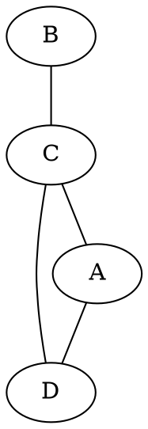

An example of this including our notation could be:

$$
	V \in \{1, 2, 3\} \ \ \ E = \{(1, 2), (2, 1), (2, 3), (3, 2)\}
$$

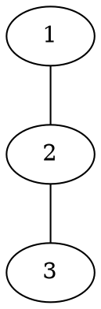

### Graph Definitions 
There are a few rules and definitions we can follow when it comes to graphs:
- If $(u,v) \in E$ then we can say that $u$ and $v$ are adjacent and are neighbours.
- The neighbourhood of a vertex $u$ is the set of $u$'s neighbours: $$N_{G}(u) = \{v \in V : (u,v) \in E\}$$ 
- The neighbourhood of a set of vertices $S \subseteq V$ is the set of all neighbours of all vertices in $U$: $$N_{G}(S) = \{v \in V : \exists{u} \in S, (u,v) \in E\}$$
- If $e = (u,v) \in E$ then we can say that $e$ is incident with $u$ and $v$
- Due to our graphs being symmetric, that being for each $(u,v) \in E$ we also have $(v,u) \in E$, we can call these pairs the same edge and when counting they are considered as one.

### Graphs in Python
```python
V = { 1, 2, 3, 4, 5 }
E = { (1, 2), (2,1), (2,3), (3,2), (3,1), (1,3), (1,4), (4,1), (4,5), (5,4) }
G = (V, E)

def N(G, u):
	V, E = G
	return { v for v in V if (u,v) in E }

def NS(G, S):
	V, E = G
	return { v for v in V for u in S if (u,v) in E }

print("Vertices", V)
print("Edges", E)
print("Neighbours of 1", N(G, 1))
print("Neighbours of {1,5}", NS(G, {1,5}))
```

### Degrees
The degree of a vertex $u$ is the size of it's neighbourhood:

$$
	d(u) = |N_{u}|
$$

For every edge $(u,v)$, 1 is added to the degree of $u$ and the degree of $v$:

$$
	2|E| = \sum_{u \in V} d(u)
$$

Since the sum of the degrees is even, that must mean that there is an even number of vertices with odd degrees. We call this the handshaking lemma.

### Paths
A path is a sequence of vertices $v_{1},v_{2},...,v_{j}$ where:
- No vertex appears more than once
- $v_{k}$ is adjacent to $v_{k+1}$ for each $k=1,...j-1$
- The length of the path is $j-1$ (the number of edges)

We can also say that an edge $(s,t)$ is in a path of $s = v_{k}$ and $t = v_{k+1}$ for some $k$.

### Cycles
A cycle is similar to a path however we start and end at the same place. This is equivalent to saying that $v_{1} = v_{j}$.
- The length of the cycle is $j-1$ (the number of edges and number of vertices)
- Due to a cycle essentially being a loop, we don't care about which vertex is the starting point as $A,B,C,A$ is the same as $B,C,A,B$
- Sometimes cycles don't duplicate the starting/ending vertex and instead just state "the cycle $A, B, C$" as opposed to "the path $A, B, C$".

### Connectedness
If there exists a path from $u$ to $v$ for every $u,v \in V$, then we can say that $G$ is connected. If this is false then we can say that $G$ is disconnected. We can also say that, if for every $u,v \in S \subseteq V$ there exists a path between $u$ and $v$ and there are no paths to any vertices outside of $S$, then $S$ is called a connected component of $G$.

### Distance
We can say that the distance between vertices $u$ and $v$ is the length of the shortest path from $u$ to $v$

### Calculating Distances
We can then calculate the distance by first fixing vertex $u$ in $V$. We can then define $D_j$ as the set of vertices that are of distance $j$ from $u$ and $V_j$ as the set of vertices that are of at least $j$ distance from $u$.

$$
	\begin{align*}
		V_{j} &= \begin{cases}
			V &: j = 0 \\
			V_{j-1} \setminus D_{j-1} &: j > 1 \\
		\end{cases} \\[5pt]
		D_{j} &= \begin{cases}
			\{u\} &: j = 0 \\
			N_{V_{j}}(D_{j-1}) &: j > 0 \\
		\end{cases} \\[5pt]
	\end{align*}
$$

For example:

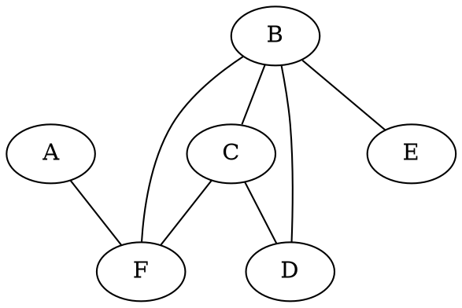

$$
	\begin{align*}
	&D_{0}(A) \\ 
	&V_{0} = V = \{A, B, C, D, E, F\} \\ 
	&V_{1} = \{B, C, D, E, F\} \\[10pt]
	&D_{1}(F) \\
	&V_{2} = \{B, C, D, E\} \\[10pt]
	&D_{2}(B, C) \\
	&V_{3} = \{D, E\} \\[10pt]
	&D_{3}(D, E) \\
	\end{align*}
$$

### Calculating Distance in Python

```python
V = { 1, 2, 3, 4, 5 }
E = { (1, 2), (2,1), (2,3), (3,2), (3,1), (1,3), (1,4), (4,1), (4,5), (5,4) }
G = (V, E)

def N(G, u):
	V, E = G
	return { v for v in V if (u,v) in E }

def NS(V, E, S):
	return { v for v in V for u in S if (u,v) in E }

def distanceClasses(V, E, u):
	V0 = V
	D = [ { u } ]
	return distanceClassesR(V0, E, D)

def distanceClassesR(V, E, D):
	Vnew = V - D[-1]

	if len(Vnew) == 0:
			return D

	Dnew = D + [ NS(Vnew, E, D[-1]) ]
	return distanceClassesR(Vnew, E, Dnew)

print(distanceClasses(V, E, 1))
```
### Bipartite Graphs
A bipartite graph is a set of graph vertices split into two disjoint sets $(A,B)$ in such a way that no two graph vertices within the same set are adjacent. If this is the case $(A,B)$ can be called a bipartition of $G$.

In the distance finding method we simply set $A = D_{0} \cup D_{2} \cup D_{4}...$ and $B = D_{1} \cup D_{3} \cup D_{5}...$. Then if no two vertices in the same distance set $(D_{j})$ are adjacent we can call $(A,B)$ a bipartition of $G$. We can also say a graph $G$ is bipartite if and only if $G$ has no cycles of odd length.

### Distance Finding Revisited
We can summarise the shortest paths algorithm as:
- Set $D_{0} = \{u\}$ (starting vertex)
- Set $D_{1} =$ neighbours of $u$
- Set $D_{2} =$ neighbours of $d_{1}$ that we haven't seen before
- ...

In this algorithm we process vertices and add them to some $D_{j}$ in order of distance where the closes vertices to $u$ come first.

### Breadth First Traversal/Search
In the breadth first traversal algorithm we process the vertices in a graph in order of distance from some initial vertex. The difference here compared to our previous distance calculating algorithm is that we do some processing on the vertices and we don't bother to keep track of the sets $D_{j}$. So if we step through this algorithm:
- Set $D_{0} = \{u\}$ and process $u$
- Set $D_{1} =$ neighbours of $u$, and process them
- Set $D_{2} =$ neighbours of $d_{1}$ that we haven't seen before and process them
- ...

```python
V = { 1, 2, 3, 4, 5 }
E = { (1, 2), (2,1), (2,3), (3,2), (3,1), (1,3), (1,4), (4,1), (4,5), (5,4) }
G = (V, E)

def NS(V, E, S):
	return { v for v in V for u in S if (u,v) in E }
    
def BFS(V, E, u):
	D = {u}
	BFSR(V, E, D)

def BFSR(V, E, D):
	for v in D:
			print(v)
	Vnew = V - D
	if len(Vnew) == 0: return 
	Dnew = NS(Vnew, E, D)
	BFSR(Vnew, E, Dnew) 
```

### Depth First Traversal
In the depth first traversal algorithm we pick the path that will take us the furthest from $u$ and then when we can't go any further we backtrack and repeat until all paths are traversed.

```python
V = { 1, 2, 3, 4, 5 }
E = { (1, 2), (2,1), (2,3), (3,2), (3,1), (1,3), (1,4), (4,1), (4,5), (5,4) }
G = (V, E)

def N(G, u):
	V, E = G                                  
	return { v for v in V if (u,v) in E }
    
def depthFirst(V, E, u):
	T = {u}                               # Set of vertices already seen
	depthFirstR(V, E, u, T)

def depthFirstR(V, E, u, T):
	print(u)                              # Process vertex u
	if len(T) == len(V): return T         # Check if we've seen all vertices
	Nu = N((V, E), u) - T                 # Neighbours not already seen
	T.update(Nu)                          # Update set of vertices already seen
	for v in Nu:
		T.update(depthFirstR(V, E, v, T))   # Add vertices seen
	return T                    
```

<br>

<h2 id="week8">Week 8: Trees</h2>

### Trees
A tree is a connected graph that does not include cycles. Some important things to note about trees is that:
- A tree will always have $|V|-1$ edges
- There will always be a unique path between any two vertices in a tree

We call a graph that has disconnections without any cycles a forest. In these types of graphs each connected component is a tree.

### Rooted Trees
In a tree graph we can identify a special vertex as the root. This allows us to gain some additional organisation to our tree graph.
- The parent of the vertex is the first vertex in the unique path to the root
- The ancestors of a vertex is its parent, its parent's parent and so on until we reach the root
- The root vertex has no parents
- Any vertex in our graph can be the root therefore we must specify it.
- We call the parent of $v$ $P(v)$

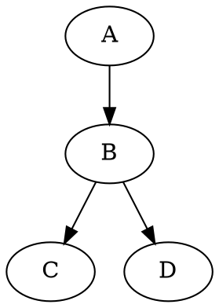

### Recursive Definition of Ancestors

Let's say we have vertex $v$, we would then call all ancestors of $v$ $A(v)$.
- If $v$ is the root, then $A(v) = \emptyset$
- If $v$ is not the root, then $A(v) = \{P(v)\} \cup A(P(v))$

In the below example, the root is chosen to be $A$ with:
- $B$'s ancestors are $A$
- $D$'s ancestors are $A$ and $B$

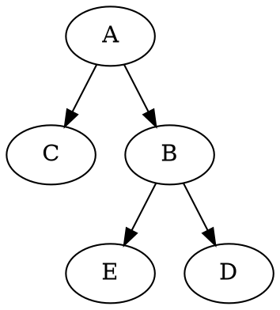

### Rooted Trees 2
We can also say that:
- A vertex's children are all of its neighbours excluding its parent
- All descendants of a vertex are considered its children, all of its children's children and so on
- We call a vertex without children a leaf

### Recursive Definition of Descendents
Let's say we have vertex $v$, we would then call the set of children of $v$ $C(v)$ and the set of descendents $D(v)$.
- If $v$ is the root, then $C(v) = N_{v}$, otherwise $C(v) = N_{v} \setminus \{P(v)\}$

We can caluclate the descendents by:
$$
	D(v) = C(v) \cup \bigcup_{u \in C(v)}{D(u)}
$$

So looking back on the graph we saw earlier we can now say that:
- $A$'s children are $C$ and $B$
- $B$'s descendants are $E$ and $D$
- The leaves are $C$, $E$, and $D$


### Sub-Graphs
A sub-graph is a smaller graph contained inside of another graph. We can say the sub-graph of a graph $G = (V, E)$ is a graph $G' = (V', E')$ such that $V' \subseteq V$ and $E' \subseteq E$.

An induced sub-graph is a sub-graph $E'$ which contains all edges of $E$ that are incident with the vertices contained in $V'$. We write this as $G(V')$.

$$
	G(V') := (V', \{(s,t) \in E : s, t \in V'\})
$$

### Sub-Trees
As well as sub-graphs we also have sub-trees. If we have a rooted tree, we can then define sub-trees.
- A sub-tree of a rooted tree on vertex $v$ is the induced sub-graph on $v$ and its descendent
- A sub-tree will always be a rooted tree, in this instance $v$ is the root

### Spanning Tree
We can identify trees inside of graphs.
- A sub-graph $T = (V,E')$ of a connected graph $G = (V, E)$ which is also a tree is called a spanning tree.
- If the graph has a spanning tree then we know it must also be connected. This means that the spanning tree gives a unique path between any two vertices in $G$

### BFS

```python
# Code referenced from Week 8 Topic 2

def NS(V, E, S):
	return { v for u in S for v in V if (u, v) in E }

def N(V, E, u):
	return { v for v in V if (u, v) in E }

# @brief Helper method to get the next item in a set
#
# @param S Set of items
# @returns the next item in the set
def arbitrary(S):
	return next(iter(S))

# @brief Function to return the parent of each vertex 
# 
# @param V A graph
# @param E Set of edges
# @param r The root
# @returns parents A set of all found parents
def spanTree(V, E, r):
	parents = { r: None }
	spanTreeR(V - {r}, E, {r}, parents)
	return parents

# @brief Recursive version of the function `spanTree`
#
# @param V A sub-graph
# @param E Set of edges
# @param D The previous distance class
# @param parents The parents of all found vertices
def spanTreeR(V, E, D, parents):
	Dnew = NS(V, E, D)
	if not Dnew: return
	for v in Dnew:
		parents[v] = arbitrary(N(D, E, v))
	spanTreeR(V - Dnew, E, Dnew, parents)
```

### Parents to Paths

```python
# Code referenced from Week 8 Topic 2

def path(parents, v):
	u = parents[v]
	if u == None: return [v]
	return path(parents, u) + [v]
```

<br>

<h2 id="week9">Week 9: Directed Graphs</h2>

### Directed Graphs
A directed graph is a graph were all edges have a direction tied to them. Directed graphs have an irreflexive relation as a node cannot be connected to itself. A directed graph is defined as $G = (V, E)$ where $E \subseteq V \times V$ and $\forall{v} \in V \ (v,v) \notin E$. Due to directed graphs containing a directional attribute we are allow to include both $(u,v)$ and $(v,u)$ as these are now counted as two separate edges.

Here is an example of a directed graph:

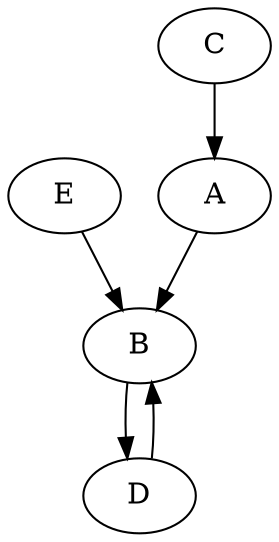

### Directed Cycles
Much like how our graphs have cycles, our directed graphs have directed cycles. For example, A,B,C,D,A is a directed cycle while A,B,C is just a cycle:

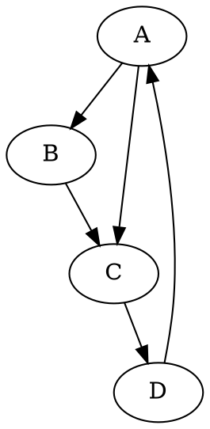

### DAG
A DAG, or Directed Acyclic Graph, is a directed graph which has no directed cycles. Here is an example:

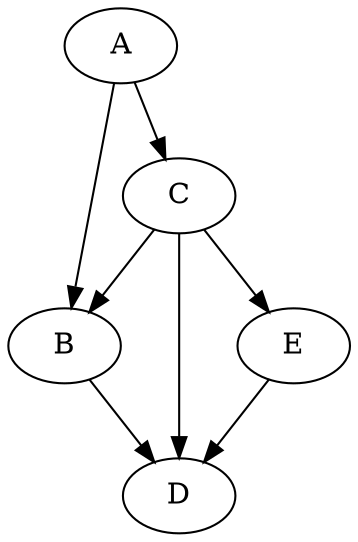

### Topological Ordering
Topological ordering is a total ordering $R$ on all the vertices of a directed graph $(V, E,)$ where if there exists $(u,v) \in E$ then $uRv$. That is to say, a topological ordering is a total ordering $R$ on all vertices where $E \subseteq R$.

It's important to remember that not every directed graph allows for topological ordering. For example, imagine we have a graph as such:

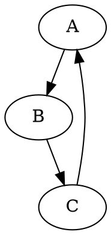

Due to topological orderings being a total orderings we must have the quality of transitivity ($\forall{a,b,c} \in A \ (aRb \land bRc) \rightarrow aRc$). In the above graph we can see we have $aRb$ and $bRc$ however we don't have $aRc$, instead we have $cRa$. 

This relationship breaks our anti-symmetric relationship therefore no longer being a total ordering and by consequence a topological ordering. To allow for a topological ordering our directed graphs must not contain any directed cycles, that is to say that our directed graph is not acyclic.

### Weighted Graphs
Sometimes when using graphs there's information we'd like to capture that just isn't possible by using graphs alone. We can add additional information to a graph by using weights. In the context of edges, an example of adding weight to an edge may be giving it a label. We can do this by defining some function $w : E \rightarrow \mathbb{R}$ ($\mathbb{R}$ can be replaced with other things like $\mathbb{Z}$, $\mathbb{N}$ or even another co-domain) where $E$ is our edge and $\mathbb{R}$ references the value associated with the edge. We can then say that for $e \in E$, the weight of $e$ is $w(e)$.

### Flows
A flow network is a directional graph where each edge has a capacity (weight) $w_e$ and a flow $f_e$. Each flow in the network contains a source and a drain and is bound by 3 constraints. The first constraint states that there exists no flow into the source and no flow out of the drain. The second constraint states that the flow on each edge cannot be a negative and must be less than the edges capacity. The third constraint states that, excluding the source and drain, the flow value going into a vertex must be equal to the flow value going out of that vertex.

We can mathematically state the source of a flow as a function $f: E \rightarrow \mathbb{R}$ where $s \in V$ represents the source and $d \in D$ represents the drain. We can then state our 3 constraints as:
1. $$\forall{(u,s)} \in E \ f((u,s)) = 0 \\ \forall{(d,u)} \in E \ f((d,u)) = 0$$
2. $\forall{e} \in E$ 
$$
	0 \le f(e) \le w(e)
$$
3. $\forall{v} \in V \setminus \{s,d\}$ 
$$
	\sum_{(u,v) \in E} f((u,v)) = \sum_{(v,u) \in E} f((v,u))
$$
Where $(u,v) \in E$ represents the edges going into some vertex $v$ and $(v,u) \in E$ represents the edges going out of some vertex $v$.

### Maximum Flows
So now that we know what a flow is we can start finding out some information about it. For example, what happens if we want to find the maximum flow in our flow network? 

We first define the value of a flow by the sum of flows coming out of the source:

$$
	\sum_{(s,u) \in E} f((s,u))
$$

And due to the conservation of flows the above is equal to the sum of flows into the drain:

$$
	\sum_{(u,d) \in E} f((u,d))
$$

The maximum flow problem on a weighted graph is to find the flow with the highest flow value.

### Augmenting Paths
Given a flow network $G=(V,E)$ where the capacities (weights) are represented as $w$ and a flow is represented as $f$. An augmenting path is a sequence of vertices $$s=v_{1},v_{2},...,v_{n}=d$$ where no vertex repeats, such that:
- For each $j=1...n-1$, either $(v_{j},v_{j+1}) \in E$ (the next vertex is in $E$) or $(v_{j+1}, v_{j}) \in E$ (the previous vertex is in $E$).
- If $e = (v_{j},v_{j+1}) \in E$ then $a(e) := w(e) - f(e) > 0$
- If $e = (v_{j+1},v_{j}) \in E$ then $a(e) := f(e) > 0$

It can then be said that the capacity of an augmenting path is the minimum $a(e)$ among all $e$ in the path. 

So how do we actually find an augmenting path? We can find one by first building a new graph $(V, E')$ where $(u,v) \in E'$ if either:
- $(u,v) \in E$ and $f((u,v)) < c((u,v))$
- $(v,u) \in E$ and $f((v,u) \gt 0)$

### Using Augmenting Paths
Now that we have a flow $f$ and an augmenting path with a capacity of $a$ we can create a new flow $g$ with a higher value using the recusive definition below.

$$
g((u,v)) :=
	\begin{cases}
		f((u,v)) + a &: \textrm{the path goes forwards along}  (u,v) \\
		f((u,v)) - a &: \textrm{the path goes backwards along}  (u,v) \\
		f((u,v)) &: \textrm{otherwise}
	\end{cases}
$$

If there exists no augmenting path then we know that the flow is maximum. We can also say that $f(e)=0$ is always a valid flow and can be used as a starting point.


### Ford-Fulkerson Method 
The Ford-Fulkerson method is a method to finding all maximum flows in a flow network. Informally we can unpack the recursive definition down to:
1. Assign all the edges the value of $f(e)=0$
2. Find a valid augmenting path. If none exist, then return $f$
3. Update $f$ according to the found augmenting path
4. Go back to step 2 and repeat

### Directed Path
A directed path is a sequence of unique vertices $v_{1},...,v_{j}$ in any directed graph $G=(V,E)$ such that $(v_{k},v_{k+1}) \in E$ for each $k=1...j-1$. Direct paths are much like their regular counterpart in undirected graphs with the only difference of not being they must respect the direction of the edges.

### Edge Cut
Given a directed graph $G$, a source $s \in V$ and a drain $d \in V$, an edge cut or cut is a set of edges $T$ such that there exists no directed path from $s$ to $d$ in the graph $(V,E \setminus T)$. In other words, any directed path going from $s$ to $d$ must go along some edge in $T$. These cuts then define the set of edges that, when removed, prevent the flow from $s$ to $d$.

The capacity of a cut is the sum of all edges in the cut. We call a cuts who's capacity is minimum along all possible cuts the minimum cut.

### Max-flow Min-cut
For any directed graph $G=(V,E)$ with source $S \in V$, drain $d \in V$, and weights $w$, then we can state that the maximum value of a flow on $G$ is equal to the minimum value of a cut of $G$. In other words, if we find a flow with the value of $v$ and we find a cut with the capacity of $v$ then we know that the flow is maximum and the cut is minimum.

### Matchings on Bipartite Graphs
A matching on a bipartite graph $G=(V,E)$ is a subset $M \subseteq E$ such that no vertex of $V$ is incident with more than one edge in $M$. A maximum matching on a graph is a matching such that no other matching on the graph has more edges. We can actually reduce the problem of finding maximum matchings to finding maximum flows. We can do this by following a four step process:
1. Add additional vertices $s$ and $d$
2. Add edges $(s,a)$ for all $a \in A$
3. Add edges $(b,d)$ for all $b \in B$
4. Add weight 1 for every edge

<br>

<h2 id="week10">Week 10: Finite State Automata</h2>

### Symbols and Alphabets
We first start with some set of symbols $\Sigma \ne \emptyset$ which we call the alphabet. The alphabet is the set $\Sigma$ and the elements represent the symbols. These symbols can be anything, for example:
- $\{0, 1\}$
- $\{a,b,c...,z\}$
- Set of all printable ASCII characters
- Set of all UNICODE characters

We can then say a string over $\Sigma$ is a sequence of symbols in $\Sigma$.
- We sometimes call these strings words
- Starting from left where the first index is 1, $x_j$ will refer to the $j$th symbol in $x$
- The length of a string is the number of symbols in the sequence
- A string of length 0 is called an empty string. We denote this with the $\varepsilon$ symbol.
- The set $\Sigma^{*}$ (the Kleene star) is the set of all strings over $\Sigma$ of any length

Much like with bit-strings we can concatenate two strings together.
- $x = s_{1}s_{2}...s_{j} \in \Sigma^*$
- $y = t_{1}t_{2}...t_{j} \in \Sigma^*$
- $xy = s_{1},s_{2}...s_{j}t_{1}t_{2}...t_{k}$

A more practical example could show:

$$
	\begin{align*}
		x = \textrm{abc} \ \ y = 123 \\
		xy = \textrm{abc}123
	\end{align*}
$$

### Languages
A language over an alphabet $\Sigma$ is a set of strings over $\Sigma$. In other words, a language $L$ is any subset $L \subseteq \Sigma^{*}$. We can specify a language in two different ways.
1. We can write out the language explicitly:

$$
	L = \{1,11,111,1111\}
$$

2. Or we can write out rules for the strings the language contains:

$$
	L = \{x \in \{0,1\}^{*} : x_{1} = 1\}
$$

### Decision Problems
For every language $L$ there exists a problem called the decision problem. This problem is all about deciding whether a given string $x \in \Sigma^{*}$ is in $L$ or not. We can phrase any computation problem with a yes or no answer as a decision problem.

### Language Operations
Due to languages being at their core being sets, we can apply operations on them such as $\cup$ or $\cap$. We can also concatenate languages by simply pairwise concatenating all their elements.

$$
	A \cdot B := \{ab : a \in A, b \in B\}
$$	

Let's see an example of this:

Let:
$$
	\begin{align*}
		A = \{0,1\}, \ \ B = \{a,b\}
	\end{align*}
$$

Then:
$$
	\begin{align*}
		A \cdot B &= \{0a, 0b, 1a, 1b\} \\
		A \cdot A &= \{00, 01, 10, 11\} \\ 
		A \cup B &= \{0,1,a,b\}
	\end{align*}
$$

### Kleene Star
We call the Kleene star of a language $A$ as the set of all possible concatenations of any length of strings from $A$.
- $A^0 := \{\varepsilon\}$
- $A^1 := A$
- $A^j := A^{j-1} \cdot A$
- $A^* := A^0 \cup A^1 \cup A^2 \cup ...$

The Kleene plus is similar to the Kleene start except we omit the empty string.

$$
	A^+ := A^0 \cup A^1 \cup A^2 \cup ... 
$$

### Regular Languages
Regular languages are particular sets of languages that have some form of structure tied to them. These can be defined by a few rules such as:
- $\emptyset$ and $\{\varepsilon\}$ are regular languages
- For each $a \in \Sigma$ we can say that $\{a\}$ is a regular language
- If $A$ and $B$ are said to be regular languages, than any combination of them be it $A \cup B$, $A \cdot B$ or $A^*$ are all regular languages
- There exist no other regular languages other than the onces described above

Some examples of regular languages could be:
- A set of IP addresses in some format (e.g. 192.168.1.1)
- A set of legal email addresses (following some format)
- A set of valid dates in DD-MM-YYYY format

### Non-regular Languages

### Languages in Python
While Python provides us a datatype for strings, these are generally only intended for Unicode characters. For strings over arbitrary elements we can use tuples. Programmatically, languages are usually dealt with by building a parser, rather than sets of strings. However, the mathematical definitions can still be implemented.

```python
>>> S = { (0, 1), (1, 1) }
>>> T = { (0, 0), (1,) }
>>>
>>> { s + t for s in S for t in T }    # Concatenate two languages
>>> {(0, 1, 1), (1, 1, 0, 0), (0, 1, 0, 0), (1, 1, 1)}
>>> S | T    # The union of languages S and T
>>> {(0, 1), (0, 0), (1, 1), (1,)}
>>>
>>> A = { 0, 1 }
>>>
>>> def strLenN(A, n):    # Strings of length n over A
>>> 	if n == 0:
>>> 		return { () }
>>> 	else:
>>> 		return { s + (a,) for s in strLenN(A, n-1) for a in A }
>>>
>>> strLenN(A, 2)
>>> {(0, 1), (1, 0), (0, 0), (1, 1)}
```

### Regular Expressions
Regular expressions are a way we can specify a regular language over an alphabet $\Sigma$. Regular expressions over an alphabet $\Sigma$ are strings over $\Sigma \cup \{(,),\mid,*\}$. Some things to note about regular expressions are:
- The empty string $\varepsilon$ is a regular expression
- $x$ is a regular expression for an $x \in \Sigma$ (literals)
- if $x$ is a regular expression then ($x$) is a regular expression
- if $x$ and $y$ are regular expressions then $xy$, $x | y$ and $x^*$ are also regular expressions

We must also follow the order of operations when it comes to regular expressions. Listed below in order from highest priority to lowest:
1. $()$
2. Kleene star
3. Concatenation
4. $\mid$

### Matching
Regular expressions are specifications for strings following a certain pattern. If the string in question follows the pattern specified by the regular expression then we can say that the regular expression matches the string. The rules for matching are:
- $\varepsilon$ matches the string $\varepsilon$
- for any $x \in \Sigma$, $x$ matches the string $x$
- for any two regular expressions $x$ and $y$, $xy$ will match a string $z$ where if $z=uv$, $x$ matches $u$ and $v$ matches $y$
- for any two regular expressions $x$ and $y$, $x | y$ will match a string $z$ if $x$ or $y$ matches $z$
- for a regular expression $x$, $x*$ matches $z$ if $z=z_{1}z_{2}...z_{j}$ and $x$ matches each of $z_1$, $z_2$, $z_j$

Some examples may include:
- (ab)+c matches abc, ababc, abababc etc
- (a|b)*c matches c, ac, bc, aac, abc, bac, bbc, aaac, etc

Using all of this we can conclude that:
- For any regular expression $x$, the set of strings that $x$ matches is a regular language
- For any regular language $L$, there exists a regular expression that matches exactly the set of strings in $L$

### Regular Expression Extensions
We can make regular expressions easier to use by adding some syntactic sugar to our syntax. Here are a few examples:
- $x$+ is the same as $xx*$
- $[xyz]$ is the same as $(x|y|z)$
- $.$ is the same thing as [ every symbol in $\Sigma$ ]

### Regular Expressions in Python
We can use regular expressions in Python by importing the module `re`. We define regular expressions as strings in Python.

```python
>>> import re
>>>
>>> r = 'a+b+c'                  # Define a regular expression
>>> s = 'blahabcddeeaabbccaa'    # Define some string
>>> re.findall(r, s)             # Return a list of all substrings matching r
['abc', 'aabbc']
>>> re.split(r, s)               # Split the string on substrings matching r
['blah', 'ddee', 'caa']
>>> re.sub(r, 'MATCH', s)        # Substitute matches of r with some text
'blahMATCHddeeMATCHcaa
>>> m = re.search(r, s)          # Search for the first match of r
>>> m.span()                     # Start and end location of the first match
(4, 7)
>>> m.group()                    # The matching substring
'abc'
```

### Finite State Automata
A finite state automoton is a computational model used to simulate sequential logic. An FSA consists of:
- An alphabet $\Sigma$
- A finite set $S$ of states
- An initial starting state $S_0 \in S$
- A set of accepting states $A \subseteq S$
- And finally a function to change the state $\delta : S \times \Sigma \rightarrow S$

We use a FSA by feeding it some input $x = x_{1}x_{2}...x_{n} \in \Sigma^*$ such that:

$$
	\begin{align*}
		t_0 &= s_0 \\
		t_j &= \delta(t_{j-1}, x_{j}) \textrm{ for } j = 1...n
	\end{align*}
$$

Where our conditional logic states:
- If $t_n \in A$ then the FSA accepts $x$
- If $t_n \notin A$ then the FSA rejects $x$

### State Change Diagrams
We can use a state change diagram to depict a FSA in a directed graph-like format where:
- Each state is a vertex
- We draw an edge $(s,t)$ with the label $x$ if $\delta(s,x) = t$
- If there exists an occurance where $\delta(s,x) = t$ for multiple $x$, then we simply draw one edge with multiple labels 
- The diagram is allowed to contain loops. That is a vertex can have an edge to itself
- Mark the accepting states (in the unit we will use a double circle)

Here is an example of a state change diagram:
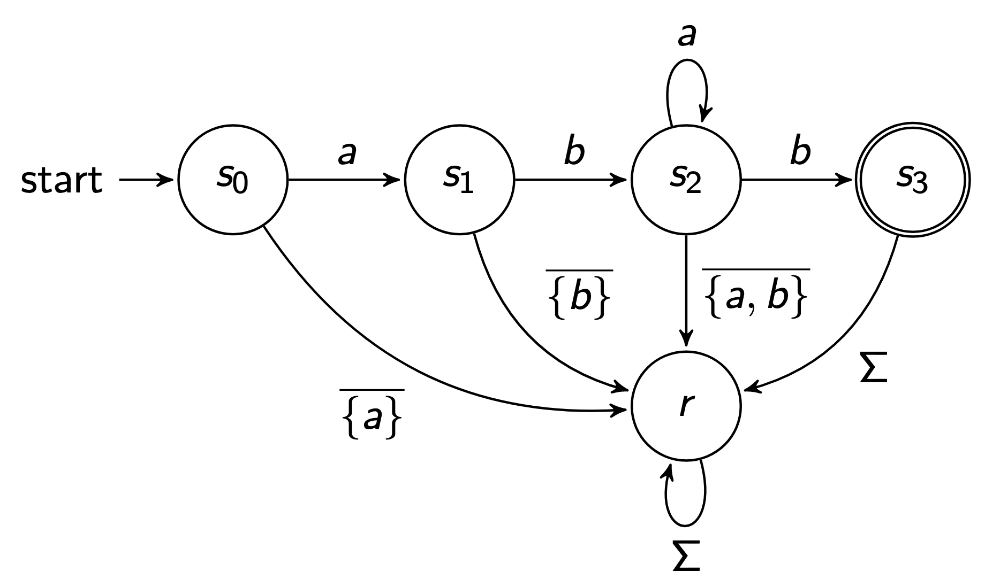

### Recognising Languages
A FSA $M = (\Sigma, S, s_{0}, \delta, A)$ recognises a language $L \subseteq \Sigma^*$ if:
- For every $x \in L$, $M$ accepts $x$
- For every $x \notin L$, $M$ rejects $x$

### Kleene's Theorem
Kleene's theorem states that the set of languages that are recognisable by some FSA is the same as the set of regular languages. That is to say, every regular language is recognised by some FSA and every FSA recognises some regular language.

### FSA Diagram Examples
This is an FSA diagram to recognise the regular expression `abab`
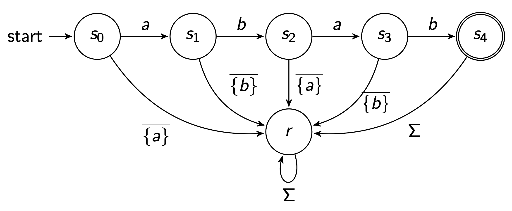

This is an FSA diagram to recognise the regular expression `aba*b`
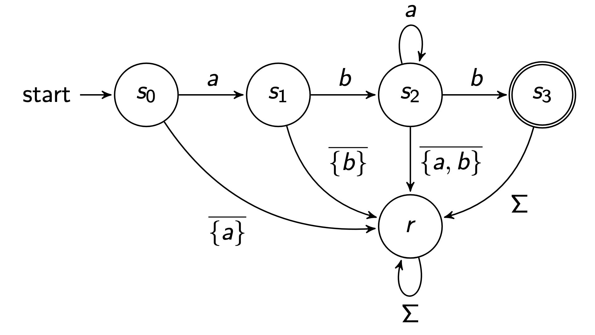

This is an FSA diagram to recognise the regular expression `aab*`
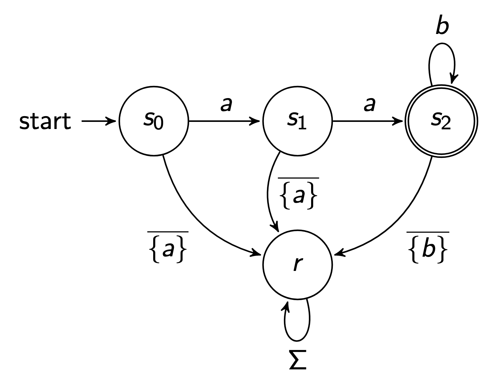

### Kleene Plus and Special Cases
There are a few special cases that break our simple method however we do have some fixes for them.
- The expression $a$+ is the same as $aa*$
- The expression $a*a$ is the same as $aa*$

There are more however we won't cover them.

### FSA's in Python

```python
delta = {
	(1, 0) : 2,
	(1, 1) : 1,
	(2, 0) : 2,
	(2, 1) : 3,
	(3, 0) : 2,
	(3, 1) : 3
}

def runFSA(start, delta, accepting, input):
	state = start

	for i in input:
		state = delta[(state, i)]

	return state in accepting

runFSA(1, delta, { 3 }, (1,0,1,1))  # True
runFSA(1, delta, { 3 }, (1,0,0))    # False
```

<br>

<h2 id="week11">Week 11: Linear Algebra</h2>

### Vectors
A vector of dimension $n$ is an element $\vec{x}$ of $\mathbb{R}^n$. We then call the real numbers $x_i$ as the coordinates or components of our vector $\vec{x}$. Visually, column vectors are represented as verticle tuples such that:

$$
	\vec{x} = \begin{pmatrix}
		x_1 \\
		x_2 \\
		\vdots \\
		x_n
	\end{pmatrix}
$$

As well as column vectors, there exists row vectors which are represented like $\vec{x} = (x_1 \ x_2 \ x_3)$

### Special Vectors
There are a few vectors that are special in some way or another. 

- The origin is a vector which contains only zeros

$$
	\vec{0} = \begin{pmatrix}
		0 \\
		0 \\
		\vdots \\
		0
	\end{pmatrix}
$$

- The standard basis vectors for dimension $n$ are special vectors. These vectors contain a 1 in only one place with the rest of the spots being zero. For $n$ dimensions, we can say that there are exactly $n$ of these vectors.

$$
	\vec{e_{1}} = \begin{pmatrix}
		1 \\
		0 \\
		0 \\
		\vdots \\
		0
	\end{pmatrix} \ \
	\vec{e_{2}} = \begin{pmatrix}
		0 \\
		1 \\
		0 \\
		\vdots \\
		0
	\end{pmatrix} \ \
	\cdots \ \
	\vec{e_{n}} = \begin{pmatrix}
		0 \\
		0 \\
		\vdots \\
		0 \\
		1 \\
	\end{pmatrix}
$$

### Operations on Vectors
Two vectors are equal under two conditions:
1. Both vectors have the same number of components
2. The corresponding components are equal

For example:
- $\vec{x} = (1 \ 2)$ and $\vec{y} = (1 \ 2)$ then $\vec{x} = \vec{y}$
- $\vec{x} = (1 \ 2)$ and $\vec{y} = (2 \ 1)$ then $\vec{x} \ne \vec{y}$
- $\vec{x} = (1 \ 1 \ 1)$ and $\vec{y} = (1 \ 1)$ then $\vec{x} \ne \vec{y}$

### Vector Operations
There are a number of operations we can apply to vectors:
- Addition/Subtraction of two vectors is done component-wise. It's important to note we can't combine 2 vectors of different sizes.
$$
	\vec{x} + \vec{y} = 
		\begin{pmatrix}
			x_1 \\
			x_2 \\
			\vdots \\
			x_n
		\end{pmatrix} +
		\begin{pmatrix}
			y_1 \\
			y_2 \\
			\vdots \\
			y_n
		\end{pmatrix} =
		\begin{pmatrix}
			x_1 + y_1 \\
			x_2 + y_2 \\
			\vdots \\
			x_n + y_n
		\end{pmatrix}
$$
- Scalar multiplication is the multiplication of some real number $a$ and a vector.
$$
	a\vec{x} =
		a \begin{pmatrix}
			x_1 \\
			x_2 \\
			\vdots \\
			x_n
		\end{pmatrix} =
		\begin{pmatrix}
			ax_1 \\
			ax_2 \\
			\vdots \\
			ax_n
		\end{pmatrix} 
$$

### Linear Combinations
Linear combination is the process of combining vector addition and scalar multiplications. Let's imagine we have $\{\vec{x_{1}},\ldots,\vec{x_{n}}\} \subseteq \mathbb{R}^n$ and $\{a_{1},\ldots,a_{n}\} \subseteq \mathbb{R}$. We can form a linear combination of the vectors such that:

$$
	\vec{y} = \sum_{j=1}^{n}a_{j}\vec{x}_{j} = a_{1}\vec{x_{1}} + \cdots + a_{n}\vec{x+{n}}
$$

Where each number $a_j$ is called a weight or coefficient. Below is a practical example of this equation.

$$
	\vec{x} =
	\begin{pmatrix}
		1 \\
		7 \\
	\end{pmatrix} \ \ \
	\vec{y} =
	\begin{pmatrix}
		4 \\
		3 \\
	\end{pmatrix} \ \ \
	a = \frac{1}{2} \ \ \
	b = -3 
$$
$$
	\begin{align*}
		\vec{z} &= a\vec{x} + b\vec{y} \\[10pt]
			&= \frac{1}{2} \begin{pmatrix}
				1 \\
				2 \\
			\end{pmatrix} +
			(-3) \begin{pmatrix}
				4 \\
				3 \\
			\end{pmatrix} \\[10pt]
			&= \begin{pmatrix}
				\frac{1}{2} \\
				1 \\
			\end{pmatrix} -
			\begin{pmatrix}
				12 \\
				9 \\
			\end{pmatrix} \\[10pt]
			&= \begin{pmatrix}
				-11.5 \\
				-8 \\
			\end{pmatrix}
	\end{align*}
$$

A basis for $\R^n$ is a set of $n$-dimensional vectors $\Beta$ such that for every vector in $\R^n$ can be written as a linear combination of the vectors in $\Beta$. For example, every vector $\vec{x} \in \R^n$ is a linear combination of $\{\vec{e_1},\ldots,\vec{e_n}\}$.

$$
	\vec{x} = \sum_{j=1}^{n}x_j\vec{e_j}
$$

For example:

$$
	\vec{x} = 
		\begin{pmatrix}
			1 \\
			2 \\
			3 \\
		\end{pmatrix} \ \ \ \
	\vec{e_1} = 
		\begin{pmatrix}
			1 \\
			0 \\
			0 \\
		\end{pmatrix}
	\vec{e_2} = 
		\begin{pmatrix}
			0 \\
			1 \\
			0 \\
		\end{pmatrix} 
	\vec{e_3} = 
		\begin{pmatrix}
			0 \\
			0 \\
			1 \\
		\end{pmatrix}
$$
$$
	\begin{align*}
		\vec{z} &= (1)\vec{e_1} + (2)\vec{e_2} + (3)\vec{e_3} \\
		&=
		1\begin{pmatrix}
			1 \\
			0 \\
			0 \\
		\end{pmatrix} +
		2\begin{pmatrix}
			0 \\
			1 \\
			0 \\
		\end{pmatrix} +
		3\begin{pmatrix}
			0 \\
			0 \\
			1 \\
		\end{pmatrix} \\
	&=
		\begin{pmatrix}
			1 \\
			0 \\
			0 \\
		\end{pmatrix} +
		\begin{pmatrix}
			0 \\
			2 \\
			0 \\
		\end{pmatrix} +
		\begin{pmatrix}
			0 \\
			0 \\
			3 \\
		\end{pmatrix} \\
	&=
		\begin{pmatrix}
			1 \\
			2 \\
			3 \\
		\end{pmatrix}
	\end{align*} \\
$$

### Dot Product
The dot product, or inner product, of two $n$-dimensional vectors $\vec{x}$ and $\vec{y}$ can be donated as such $\vec{x} \cdot \vec{y}$. The dot product of two vectors will produce their scalar value and can be achieved by multiplying the corresponding components and adding their result.

$$
	\vec{x} \cdot \vec{y} = \sum_{j=1}^{n}x_{j}y_{j}
$$

For example:

$$
	\begin{align*}
		\begin{pmatrix}
			1 \\
			2 \\
		\end{pmatrix} \cdot
		\begin{pmatrix}
			3 \\
			4 \\
		\end{pmatrix} &=
		1 \cdot 3 + 2 \cdot 4 \\ &= 3 + 8 \\ &= 11
	\end{align*}
$$

### Linear Transformations
Earlier through the semester we studied functions. It turns out that we can define functions over vectors such that $f : \R^n \rightarrow \R^n$. A linear transformation, or linear function, $f : \R^n \rightarrow \R^n$ satisfies:

$$
	f(a\vec{x} + b\vec{y}) = af(\vec{x}) + bf(\vec{y})
$$

What this means is that lines map to lines and the origin maps to the origin.

Here are some linear transformation examples:
Linear:
- $$ f 
	\begin{pmatrix}
		\begin{pmatrix}
			x \\
			y \\
		\end{pmatrix}
	\end{pmatrix} = 
	\begin{pmatrix}
			4x + 3y \\
			x - y \\
		\end{pmatrix} 
$$
- $$ f 
	\begin{pmatrix}
		\begin{pmatrix}
			x \\
			y \\
		\end{pmatrix}
	\end{pmatrix} = 
	\begin{pmatrix}
			y \\
			-x \\
		\end{pmatrix} 
$$

Non-linear
- $$ f 
	\begin{pmatrix}
		\begin{pmatrix}
			x \\
			y \\
		\end{pmatrix}
	\end{pmatrix} = 
	\begin{pmatrix}
			x^2 \\
			y \\
		\end{pmatrix} 
$$
- $$ f 
	\begin{pmatrix}
		\begin{pmatrix}
			x \\
			y \\
		\end{pmatrix}
	\end{pmatrix} = 
	\begin{pmatrix}
			\cos x \\
			\sin y \\
		\end{pmatrix} 
$$

### Matrices
A matrix can be said to be the product of a combination of vectors. 
- A matrix of size $m \times n$ has $m$ rows and $n$ columns. 
- We can say that a matrix is square if $m = n$. In other words if the number of rows and number of columns are equal.

Here are a few examples of matrices:

$$
\begin{pmatrix}
	1 & 0 \\
	0 & -1
\end{pmatrix},
\begin{pmatrix}
	0 & 2 \\
	0.5 & \sqrt{2} \\
	1 & 1
\end{pmatrix},
\begin{pmatrix}
	0 & 0 & 0 & 1 \\
	0 & 0 & 1 & 0
\end{pmatrix}
$$

For a $m \times n$ matrix $A$, the items inside are refered to by $a_{jk}$ where $j$ refers to the items row and $k$ refers to the items column.

$$
  A_{m\times n} =
  \left( {\begin{array}{cccc}
    a_{11} & a_{12} & \cdots & a_{1n}\\
    a_{21} & a_{22} & \cdots & a_{2n}\\
    \vdots & \vdots & \ddots & \vdots\\
    a_{m1} & a_{m2} & \cdots & a_{mn}\\
  \end{array} } \right)
$$

### Special Matrices
Similar to how we have special vectors, there also exist special matrices.

- The zero matrix, denoted as $0_{m \times n}$, is a matrix which consist of only 0's

$$
  0_{m \times n} =
  \left( {\begin{array}{cccc}
    0 & 0 & \cdots & 0 \\
    0 & 0 & \cdots & 0 \\
    \vdots & \vdots & \ddots & \vdots \\
    0 & 0 & \cdots & 0 \\
  \end{array} } \right)
$$

- The identity matrix, denoted as $I$, is a square matrix with 1's along the diagonal and 0's elsewhere. There exists a separate identity for each dimension $n$
$$
  I =
  \left( {\begin{array}{cccc}
    1 & 0 & \cdots & 0 \\
    0 & 1 & \cdots & 0 \\
    \vdots & \vdots & \ddots & \vdots \\
    0 & 0 & \cdots & 1 \\
  \end{array} } \right)
$$
This can also be described as
$$
I_{jk} = \begin{cases}
		1 &: j=k \\
		0 &: \textrm{otherwise}
	\end{cases} 
$$

### Matrix Operations
#### Matrix Equality
It can be said that two matrices $A$ and $B$ are equal if the corresponding entries are equal. That is $a_{jk} = b_{jk}$ for each $j = 1,2,\dots,m$ and each $k = 1,2,\dots,n$. For two matrices to be equal they must be of the same size.

#### Matrix Addition
Two matricies can be added together so long as their dimensions are the same. Matrix addition is simply the addition of the corresponding entries. For example, $A + B = C$ where $c_{jk} = a_{jk} + b_{jk}$ for each $j=1,2,\dots,m$ and $k=1,2,\dots,n$\dots

For example,
$$
	\begin{align*}
		\begin{pmatrix}
			2 & 5 \\
			7 & -1
		\end{pmatrix} +
		\begin{pmatrix}
			4 & 3 \\
			-2 & 1
		\end{pmatrix} &=
		\begin{pmatrix}
			2+4 & 5+3 \\
			7+(-2) & -1+1
		\end{pmatrix} \\[10pt] &= 
		\begin{pmatrix}
			6 & 8 \\
			5 & 0
		\end{pmatrix}
	\end{align*}
$$

#### Scalar Multiplication
In scalar multiplcation we simply multiply every element in the matrix by our scalar value.
- Let $kA$ denote the scalar product of $k \in \R$ and matrix $A$
- $kA$ can be obtained by multiplying every entry in $A$ by $k$

$$
  kA =
  \left( {\begin{array}{cccc}
    k \cdot a_{11} & k \cdot a_{12} & \cdots & k \cdot a_{1n} \\
    k \cdot a_{21} & k \cdot a_{22} & \cdots & k \cdot a_{2n} \\
    \vdots & \vdots & \ddots & \vdots \\
    k \cdot a_{m1} & k \cdot a_{m2} & \cdots & k \cdot a_{mn} \\
  \end{array} } \right)
$$

For example,
$$
	\begin{align*}
		(-2)
		\begin{pmatrix}
			2 & 5 \\
			7 & -1
		\end{pmatrix} &=
		\begin{pmatrix}
			-2 \cdot 2 & -2 \cdot 5\\
			-2 \cdot 7 & -2 \cdot -1
		\end{pmatrix} \\[10pt] &= 
		\begin{pmatrix}
			-4 & -10 \\
			-14 & 2
		\end{pmatrix}
	\end{align*}
$$

#### Multiplying Matrices by Vectors
If we have some $\vec{x} \in \R^n$ and a $n \times n$ matrix $A$, we can multiply them together to produce another vector. It's important to note that the matrix must go on the left when being multiplied by a column vector. 

$$
	\vec{z} = A\vec{x}
$$

where

$$
	z_j = \sum_{k=1}^n a_{jk} x_k
$$

or equivalently, where $\vec{c_j}$ are the columns of $A$

$$
	z_j = A\vec{x} = \sum_{k=1}^n x_j \vec{c_j}
$$

That is, where $A\vec{x}$ is a linear combination of the columns of $A$ with the coefficients given by the entries of $\vec{x}$

For example,
$$
	\begin{align*}
		\begin{pmatrix}
			1 & 2 \\
			3 & 4
		\end{pmatrix}
		\begin{pmatrix}
			7 \\
			5 
		\end{pmatrix} &=
		\begin{pmatrix}
			\begin{pmatrix}
				1 \\
				2 
			\end{pmatrix} \cdot \begin{pmatrix}
				7 \\
				5 
			\end{pmatrix} \\[10pt]
			\begin{pmatrix}
				3 \\
				4 
			\end{pmatrix} \cdot \begin{pmatrix}
				7 \\
				5 
			\end{pmatrix}\\ 
		\end{pmatrix} \\[23pt] &= 
		\begin{pmatrix}
			1 \cdot 7 + 2 \cdot 5 \\
			3 \cdot 7 + 4 \cdot 5
		\end{pmatrix} \\[10pt] &= 
		\begin{pmatrix}
			17 \\
			41
		\end{pmatrix}
	\end{align*}
$$

Another way of looking at this could be
$$
	\begin{align*}
		\begin{pmatrix}
			1 & 2 \\
			3 & 4
		\end{pmatrix}
		\begin{pmatrix}
			7 \\
			5 
		\end{pmatrix} &=
		7 \begin{pmatrix}
			1 \\
			3
		\end{pmatrix} +
		5 \begin{pmatrix}
			2 \\
			4
		\end{pmatrix} \\[10pt] &= 
		\begin{pmatrix}
			7 \\
			21
		\end{pmatrix} +
		\begin{pmatrix}
			10 \\
			20
		\end{pmatrix} \\[10pt] &=
		\begin{pmatrix}
			17 \\
			41
		\end{pmatrix}
	\end{align*}
$$

### More about the Identity Matrix
We saw the identity matrix a little bit earlier in this guide but we didn't quite talk about what makes it so special. The identity matrix is a special square matrix where the diagonal consists of 1's and everywhere else 0.

$$
  I =
  \left( {\begin{array}{cccc}
    1 & 0 & \cdots & 0 \\
    0 & 1 & \cdots & 0 \\
    \vdots & \vdots & \ddots & \vdots \\
    0 & 0 & \cdots & 1 \\
  \end{array} } \right)
$$

What makes this matrix so special is that if we multiply some vector by it, nothing will happen. That is to say that the identity matrix is a special matrix that leaves all vectors alone.

$$
	\forall\vec{x} \ I\vec{x} = \vec{x}
$$

For example,
$$
	\begin{align*}
		I_{2}\vec{x} =
		\begin{pmatrix}
			1 & 0 \\
			0 & 1
		\end{pmatrix}
		\begin{pmatrix}
			7 \\
			5
		\end{pmatrix} &= 
		7 \begin{pmatrix}
			1 \\
			0
		\end{pmatrix} +
		5 \begin{pmatrix}
			0 \\
			1
		\end{pmatrix} \\[10pt] &= 
		\begin{pmatrix}
			7 \\
			0
		\end{pmatrix} +
		\begin{pmatrix}
			0 \\
			5
		\end{pmatrix} \\[10pt] &=
		\begin{pmatrix}
			7 \\
			5
		\end{pmatrix}
	\end{align*}
$$

### Linear Transformations Revisited
Now that we know more about matrices and the way they can interact with other components it's important to make the connection that:
- Every linear transformation can be represented as multiplying a vector by a matrix
- Multiplying a vector by a matrix is a linear transformation

### Matrix Multiplication
Matrix multiplication is really just a function composition for matrices

$$
	A(B\vec{x}) = (AB)\vec{x}
$$

We can multiply two matricies, $A$ and $B$, together by:

$$
	(AB)_{jk} \sum_{\ell=1}^nA_{j\ell}B_{\ell k}
$$

It's important to note that $AB$ is not always the same as $BA$

For example,
$$
\begin{align*}
		\begin{pmatrix}
			a & b \\
			c & d
		\end{pmatrix}
		\begin{pmatrix}
			e & f \\
			g & h
		\end{pmatrix} &=
		\begin{pmatrix}
			(ae+bg) & (af+bh) \\
			(ce+dg) & (cf + dh)
		\end{pmatrix}
	\end{align*}
$$

### Matrix Inverse
Matrices can sometimes have an inverse where

$$
(A^{-1}A)\vec{x} = \vec{x}
$$

Equivalently, $A^{-1}A = I$ since $I\vec{x} = \vec{x}$

So how do we know if a matrix can have an inverse or not? We can use something called the determinant to help us with this problem. Let's see an example with a $2 \times 2$ matrix:

$$
	\textrm{det} \begin{pmatrix}
		a & b \\ c & d
	\end{pmatrix} := ad - bc
$$

A square matrix $A$ has an inverse if and only if $\textrm{det}(A) \ne 0$

Finding the inverse of a $2 \times 2$ matrix is simple:

$$
	\begin{pmatrix}
		a & b \\ c & d
	\end{pmatrix}^{-1} = 
	\frac{1}{ad-bc} \begin{pmatrix}
		d & -b \\ -c & a
	\end{pmatrix}
$$

If the determinate is $0$ then the fomrula will not work showing that the matrix does not have an inverse.

For example:
$$
	\begin{align*}
		\begin{pmatrix}
			1 & 2 \\ 3 & 4
		\end{pmatrix}^{-1} &= 
		\frac{1}{(1 \cdot 4)-(2 \cdot 3)} \begin{pmatrix}
			4 & -2 \\ -3 & 1
		\end{pmatrix} \\[10pt]
		&= \frac{1}{-2} \begin{pmatrix}
			4 & -2 \\ -3 & 1
		\end{pmatrix} \\[10pt]
		&= \begin{pmatrix}
			4/(-2) & (-2)/(-2) \\[5pt]
			(-3)/(-2) & 1/(-2)
		\end{pmatrix} \\[15pt]
		&= \begin{pmatrix}
			-2 & 1 \\[5pt]
			1.5 & -0.5
		\end{pmatrix} 	
	\end{align*}
$$

### Linear Transformations

#### Rotations
To rotate a matrix at an angle of $\theta$ anti-clockwise, the linear transformation below can be applied:

$$
	\begin{pmatrix}
		\cos{\theta} & -\sin{\theta} \\
		\sin{\theta} & \cos{\theta}
	\end{pmatrix}
$$

For example, to rotate a matrix by $45\degree$ anti-clockwise

$$
	\frac{1}{\sqrt{2}}\begin{pmatrix}
		1 & -1 \\
		1 & 1
	\end{pmatrix}
$$

#### Scalings
A matrix can be scaled up or down, or scaled by different axes in different amounts. To scale a matrix by $a$:

$$
	\begin{pmatrix}
		a & 0 \\
		0 & a
	\end{pmatrix}
$$

To scale a matrix in the x direction by $a$ and the y direction by $b$:

$$
	\begin{pmatrix}
		a & 0 \\
		0 & b
	\end{pmatrix}
$$

#### Reflections
A matrix can be reflected about an axis. To reflect about the $x$ axis, use:

$$
	\begin{pmatrix}
		1 & 0 \\
		0 & -1
	\end{pmatrix}
$$

To reflect about the $y$ axis, use:

$$
	\begin{pmatrix}
		-1 & 0 \\
		0 & 1
	\end{pmatrix}
$$

#### Projections
Projects flatten one dimension down to nothing. To project a matrix onto the $y$ axis (or flatten the $x$ axis), use:

$$
	\begin{pmatrix}
		0 & 0 \\
		0 & 1
	\end{pmatrix}
$$

To project a matrix onto the $y$ axis (or flatten the $y$ axis), use:
$$
	\begin{pmatrix}
		1 & 0 \\
		0 & 0
	\end{pmatrix}
$$

### Translations and Affine Transformations
An Affine transformation is a transformation that maps lines to lines but doesn't necessarily map the origin to the origin. Affine transformations take on the form of:

$$
	f(\vec{x}) = A\vec{x} + \vec{t}
$$

A translation on the other hand is a class of affine transformation that takes on the form:

$$
	f(\vec{x}) = \vec{x} + \vec{t}
$$

Homogeneous coordinates allow affine transformations to be treated as linear transformations in a higher dimensional vector space.

### Linear Algebra in Python
To do linear algebra in Python we first need to import a package called Numpy.

```python
>>> import numpy as np

>>> A = np.array([[0,-1],[1,0]])   # Create a 2x2 matrix
>>> print(A)
[[ 0 -1]
 [ 1  0]]

>>> x = np.array([1,2])            # Numpy uses row vectors
>>> print(x)
[1 2]


>>> y = A @ x                      # Matrix-vector multiplication is denoted
>>> print(y)  			           # with the @ operator
[-2  1]

>>> print(x.dot(y))                # Get the dot product of 2 vectors
0

>>> print(x + y)                   # Vector addition
[-1  3]

print(3 * x)                       # Scalar multiplication
[3 6]

>>> import numpy.linalg
>>> B = np.linalg.inv(A)           # Get the inverse of a matrix
>>> print(A @ B)
[[1. 0.]
 [0. 1.]]
```

### Solving Simultaneous Equations
Let's suppose we have two linear equations with two unknowns that we wan't to solve

$$
	\begin{align*}
		ax + by = e \\
		cx + dy = f
	\end{align*}
$$

We can actually represent this equation as a set of matrices and vectors

$$
	\begin{pmatrix}
		a & b \\
		c & d
	\end{pmatrix}
	\begin{pmatrix}
		x \\
		y
	\end{pmatrix} = 
	\begin{pmatrix}
		e \\
		f
	\end{pmatrix}
$$

Now that the equation is in matrix form we can simply solve it by finding the inverse of the matrix
$$
	\begin{pmatrix}
		x \\
		y
	\end{pmatrix} = 
	\begin{pmatrix}
		a & b \\
		c & d
	\end{pmatrix}^{-1}
	\begin{pmatrix}
		e \\
		f
	\end{pmatrix}
$$

We could also use Numpy to help use solve the simultaneous equations in matrix form. Let's suppose,

$$
	\begin{align*}
		2x + 3y &= 5 \\
		(1/3)x + 7y &= -13
	\end{align*}
$$

We then put this equation into matrix form

$$
	\begin{pmatrix}
		2 & 3 \\
		1/3 & 7
	\end{pmatrix}
	\begin{pmatrix}
		x \\
		y
	\end{pmatrix} = 
	\begin{pmatrix}
		5 \\
		-13
	\end{pmatrix}
$$

And now we can put this data into Python

```python
import numpy as np
import numpy.linalg as la

A = np.array(
	[ 
		[2, 3],
		[1/3, 7] 
	]
)

B = np.array([5, -13])

solution = la.inv(A) @ B    # array([ 5.69230769, -2.12820513 ])
```

### 3D Graphics
It's interesting to note how matrices and vectors are used when it comes to computing, especially with 3D graphics. 3D objects are usually modelled as a mesh of points where each point is represeted as a 3-dimensional vector. The pose, short for position and orientation, of the virtual camera is generally represented as an affine transformation where the translation part tells us where the camera is and the linear part tells us where the camera is looking. A projection can be used to render a 3D scene down to a 2D image. Finally homogeneous coordinates are usually used so that poses are valid linear transformations.

### Robotics
Robotics is also another place linear algebra is used frequently. 
- The pose of the base of the robot is represented by an affine transformation
- The pose of each joint, relative to the previous, is represented by an affine transformation
- The composition of all transformations determines the pose of the manipulator
- Homogeneous coordinates are used meaning everything is a linear transformation and we can use matrix multiplication